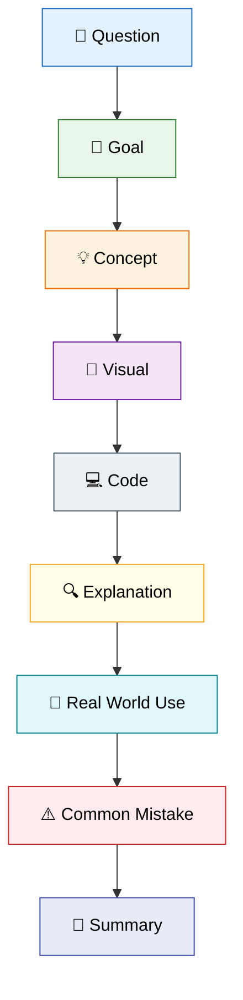
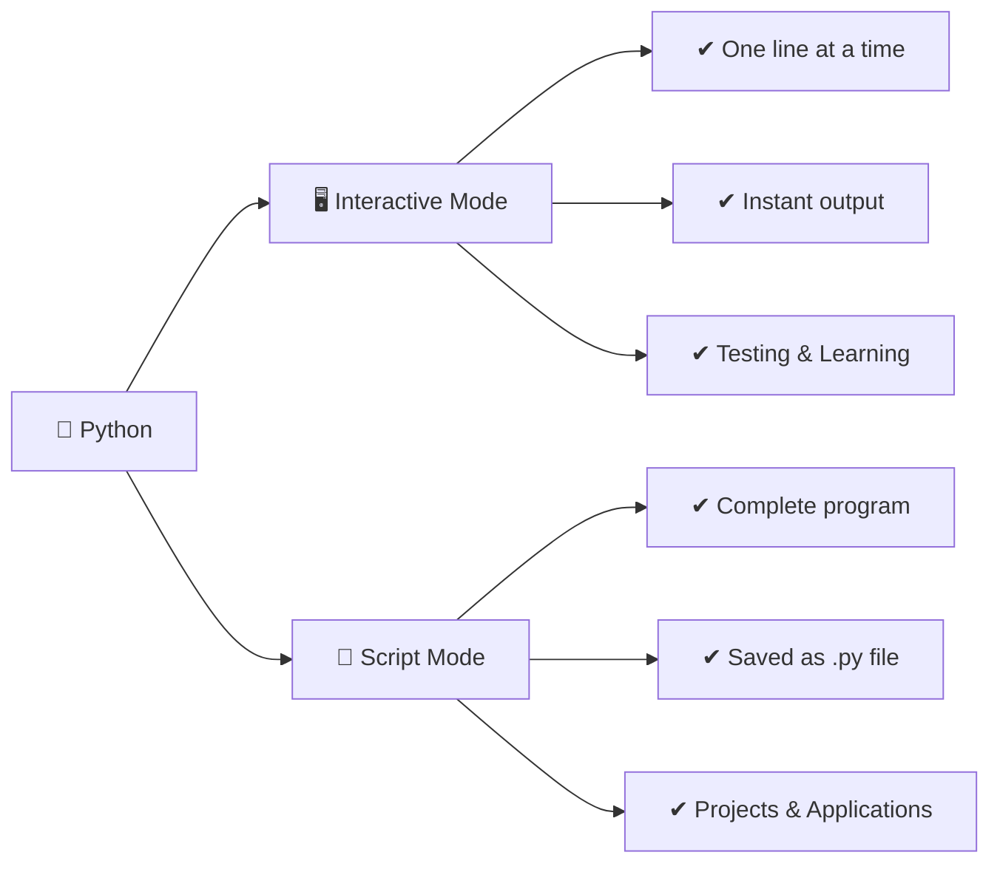
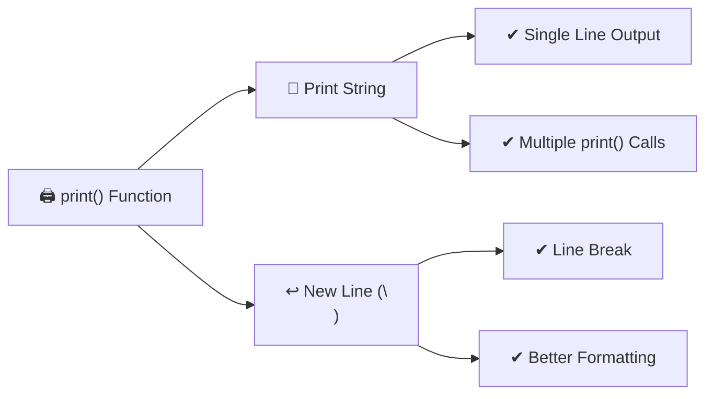
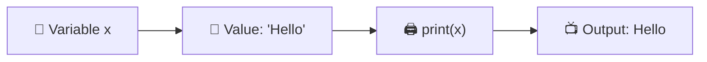
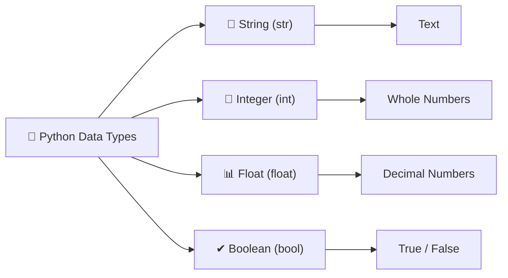
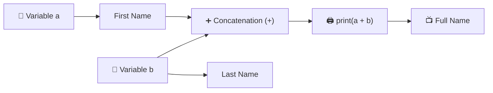
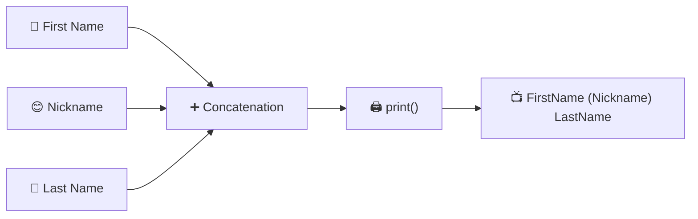
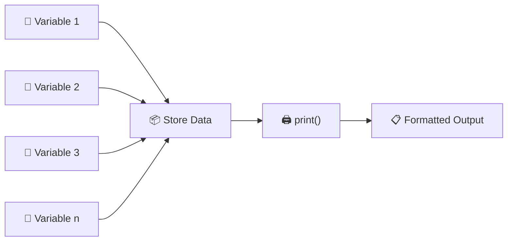

<div align="center">

# 🐍 PyNotes

## *by Ravinder Singh*

### **Learn Python the Simple Way**

---

💡 **Simple Concepts** • 👀 **Visual Learning** • 💻 **Clean Code**

<br>

| **Details** | **Information** |
|:------------|:----------------|
| 👤 **Name** | Ravinder Singh |
| 🆔 **SAP ID** | 590030651 |
| 🎓 **Program** | MCA (2026-28) |
| 📖 **Semester** | I |
| 📚 **Subject** | Bridge Course |
| 🧪 **Experiment** | 01 |
| 👨‍🏫 **Faculty** | Mr. Vibhu Gautam |

---

### 🚀 *Code • Learn • Grow*

</div>

## 🗺️ Learning Flow



---

# 📘 **Experiment 01**

## **Python Installation & Getting Started**

---

### 📖 Overview

In this experiment, you'll learn how to install Python, understand the difference between Interactive and Script Mode, and write your first Python program.

---

### 🎯 Learning Objectives

- Install Python
- Understand Interactive Mode
- Understand Script Mode
- Execute Python programs
- Use Jupyter Notebook

---

### 📚 Topics Covered

- Python Installation
- Interactive Programming
- Script Programming
- print()
- Comments
- Variables
- Input & Output

---

### 🎓 Expected Outcome

After completing this experiment, you'll be able to write, execute, and understand basic Python programs.

---

# 📌 Question 1

> **Install Python and understand the difference between Interactive Mode and Script Mode in IDLE.**

## 🎯 Goal

After completing this question, you will be able to:

- Verify that Python is installed on your system.
- Check the installed Python version.
- Understand the difference between Interactive Mode and Script Mode.
- Know when to use each mode.

## 💡 Concept

Python provides **two ways to execute programs**:

- **Interactive Mode:** Executes one statement at a time and displays the output immediately. It is ideal for learning, testing, and debugging.

- **Script Mode:** Executes an entire Python program saved in a `.py` file. It is best suited for developing complete applications and assignments.

## 🧠 Visual



## 💻 Implementation


```python
import sys

print("Python is installed.")
print("Version:", sys.version)
```

    Python is installed.
    Version: 3.13.5 | packaged by Anaconda, Inc. | (main, Jun 12 2025, 16:37:03) [MSC v.1929 64 bit (AMD64)]
    

## 🔍 Explanation

- `import sys` imports Python's built-in **sys** module.
- `sys.version` displays the installed Python version.
- `print()` is used to display information on the screen.
- If the Python version is displayed successfully, it confirms that Python has been installed correctly.

## 🚀 Real World Use

| Mode | Used For |
|------|----------|
| 🖥️ Interactive Mode | Learning Python, testing code snippets, and debugging programs. |
| 📄 Script Mode | Developing applications, automating tasks, performing data analysis, and writing Python projects. |

## ⚠️ Common Mistakes

- Forgetting to save the `.py` file before running it.
- Confusing Interactive Mode with Script Mode.
- Assuming `sys.version` installs Python instead of displaying its version.
- Running Python code in the wrong environment or interpreter.

## 📝 Summary

- Python programs can be executed in **Interactive Mode** or **Script Mode**.
- Interactive Mode runs one statement at a time.
- Script Mode runs the complete program stored in a `.py` file.
- `sys.version` is used to check the installed Python version.
- Script Mode is the preferred choice for writing complete Python programs.

***

# 📌 Question 2

>Write Python programs to print strings in the given manner.

## 🎯 Goal

After completing this question, you will be able to:

- Understand how to use the `print()` function.
- Print text on the screen using string literals.
- Display output on a single line and multiple lines.
- Use escape sequences like `\n` for formatting.

## 💡 Concept

The `print()` function is one of the most commonly used functions in Python. It is used to display text, numbers, variables, and other data on the screen.

A **string** is a sequence of characters enclosed in single (`' '`) or double (`" "`) quotes.

Python also supports **escape sequences**, such as `\n`, to format the output by inserting a new line.

## 🧠 Visual



## 💻 Implementation


```python
# 2(a)
# print("Hello Everyone !!!")
print("Hello sir have a good day greeting by Ravi")

# 2(b)
# print("Hello")
# print("World")
print("hello")
print("Sir")

# 2(c)
# print("Hello\nWorld")
print("Hello\nSir")

# 2(d)
# print("Rohit's date of birth is 12\05\1999")
print("My DOB is 30th of april 2002")
```

    Hello sir have a good day greeting by Ravi
    hello
    Sir
    Hello
    Sir
    My DOB is 30th of april 2002
    

## 🔍 Explanation

- `print()` displays the given output on the screen.
- Text enclosed within quotes is treated as a **string**.
- Each `print()` statement automatically moves the cursor to the next line after printing.
- The `\n` escape sequence inserts a new line within the same `print()` statement.

## 🚀 Real World Use

| Feature | Used For |
|---------|----------|
| `print()` | Displaying messages, results, and debugging information. |
| Strings | Showing names, addresses, notifications, and user-friendly text. |
| `\n` | Formatting reports, invoices, logs, and console output. |

## ⚠️ Common Mistakes

- Forgetting quotation marks around strings.
- Missing a closing quotation mark.
- Writing `\n` outside a string.
- Confusing multiple `print()` statements with the `\n` escape sequence.

## 📝 Summary

- `print()` is used to display output in Python.
- Strings must be enclosed within quotation marks.
- Multiple `print()` statements print on separate lines.
- The `\n` escape sequence creates a new line within a single string.
- Proper formatting makes program output more readable.

***

# 📌 Question 2

>**Declare a string variable called `x` and assign it the value `Hello`. Print the value of `x`.**

## 🎯 Goal

After completing this question, you will be able to:

- Understand what a variable is.
- Declare a string variable in Python.
- Assign a value to a variable.
- Display the value of a variable using the `print()` function.

## 💡 Concept

A **variable** is a named storage location used to store data in memory. In Python, a variable is created automatically when a value is assigned to it.

A **string** is a sequence of characters enclosed in single (`' '`) or double (`" "`) quotation marks.

Variables make programs more flexible because the stored value can be reused or updated whenever needed.

## 🧠 Visual



## 💻 Implementation


```python
x="Hello"
print(x)
```

    Hello
    

## 🔍 Explanation

- `x = "Hello"` creates a variable named **x** and stores the string **"Hello"**.
- `print(x)` retrieves the value stored in the variable and displays it on the screen.
- The variable name is **not** enclosed in quotation marks when printing its value.

## 🚀 Real World Use

| Feature | Used For |
|---------|----------|
| Variables | Storing names, marks, prices, IDs, and other data. |
| Strings | Displaying messages, labels, and user information. |
| `print()` | Showing the stored data to the user. |

## ⚠️ Common Mistakes

- Writing `print("x")` instead of `print(x)`.
- Forgetting quotation marks while assigning a string.
- Using a variable before assigning it a value.
- Using different variable names, such as assigning to `x` but printing `X`.

## 📝 Summary

- A variable stores data in memory.
- Strings are enclosed in quotation marks.
- Values are assigned using the `=` operator.
- `print()` displays the value stored in a variable.
- Variables make Python programs reusable and easier to maintain.|

---

# 📌 Question 4

>**Take different data types and print values using the `print()` function.**

## 🎯 Goal

After completing this question, you will be able to:

- Understand the basic data types in Python.
- Declare variables of different data types.
- Display different types of values using the `print()` function.
- Identify the appropriate data type for different kinds of information.

## 💡 Concept

Python supports different **data types** to store different kinds of information.

Some commonly used data types are:

- **String (`str`)** → Stores text.
- **Integer (`int`)** → Stores whole numbers.
- **Float (`float`)** → Stores decimal numbers.
- **Boolean (`bool`)** → Stores logical values (`True` or `False`).

The `print()` function can display values of all these data types.

## 🧠 Visual



## 💻 Implementation


```python
integer=58
decimal=21.22
text="text value"
boolean=True
lst=["a","b","c"]

print(integer,decimal,text,boolean,lst,sep="\n")
```

    58
    21.22
    text value
    True
    ['a', 'b', 'c']
    

## 🔍 Explanation

- `name` stores a **string** value.
- `age` stores an **integer** value.
- `height` stores a **float** (decimal) value.
- `is_student` stores a **boolean** value.
- The `print()` function displays each variable along with its value.

## 🚀 Real World Use

| Data Type | Used For |
|-----------|----------|
| String (`str`) | Names, addresses, messages, email IDs |
| Integer (`int`) | Age, marks, quantity, roll numbers |
| Float (`float`) | Height, weight, price, percentage |
| Boolean (`bool`) | Login status, eligibility, pass/fail conditions |

## ⚠️ Common Mistakes

- Forgetting quotation marks around string values.
- Writing decimal numbers as strings instead of floats.
- Using `true` or `false` instead of `True` or `False` (Python is case-sensitive).
- Mixing different data types without understanding their purpose.

## 📝 Summary

- Python provides different data types to store different kinds of information.
- `str` stores text.
- `int` stores whole numbers.
- `float` stores decimal numbers.
- `bool` stores logical values (`True` or `False`).
- The `print()` function can display values of any data type.

***

# 📌 Question 5

>**Take two variables `a` and `b`. Assign your first name and last name. Print your full name by adding both.**

## 🎯 Goal

After completing this question, you will be able to:

- Understand how to declare multiple variables.
- Store text using string variables.
- Combine two strings using the `+` operator.
- Display the combined result using the `print()` function.

## 💡 Concept

In Python, multiple variables can store different pieces of information. When two string variables are combined using the **`+` (concatenation) operator**, they form a single string.

This process is called **string concatenation**.

## 🧠 Visual



## 💻 Implementation


```python
a="Ravinder"
b="Singh"
print(a+b)
```

    RavinderSingh
    

## 🔍 Explanation

- `a` stores the first name.
- `b` stores the last name.
- The `+` operator joins the two strings together.
- `print()` displays the combined full name on the screen.

## 🚀 Real World Use

| Feature | Used For |
|---------|----------|
| Variables | Storing user information such as names and addresses. |
| String Concatenation (`+`) | Creating full names, email messages, file paths, and formatted text. |
| `print()` | Displaying the final output to the user. |

## ⚠️ Common Mistakes

- Forgetting quotation marks around string values.
- Forgetting to include a space between the first and last name while concatenating.
- Using undefined variables.
- Trying to concatenate incompatible data types without conversion.

## 📝 Summary

- Variables store individual pieces of data.
- Strings can be combined using the `+` operator.
- Combining strings is called **string concatenation**.
- `print()` displays the concatenated result.
- String concatenation is commonly used to build meaningful text from multiple values.

---

# 📌 Question 6

>**Declare first name, last name, and nickname. Print the output in the following format:**

**FirstName (Nickname) LastName** 

## 🎯 Goal

After completing this question, you will be able to:

- Declare multiple string variables.
- Store first name, nickname, and last name separately.
- Combine multiple strings into a single formatted output.
- Display the formatted text using the `print()` function.

## 💡 Concept

Python allows multiple string variables to be combined into a meaningful output.

Using the **`+` (concatenation) operator**, strings, spaces, and special characters like parentheses `()` can be joined to create a well-formatted message.

This technique is commonly used to display names, addresses, and other formatted text.

## 🧠 Visual



## 💻 Implementation


```python
first_name=a
last_name=b
nickname="(Ravi)"
print(first_name,nickname,last_name,sep=" ")
```

    Ravinder (Ravi) Singh
    

## 🔍 Explanation

- Three string variables store the first name, nickname, and last name.
- Parentheses `()` and spaces are added as strings to format the output.
- The `+` operator joins all parts into one complete string.
- `print()` displays the formatted name on the screen.

## 🚀 Real World Use

| Feature | Used For |
|---------|----------|
| Multiple Variables | Storing different pieces of user information. |
| String Concatenation | Creating full names, usernames, and formatted text. |
| Formatted Output | Displaying names in applications, certificates, profiles, and reports. |

## ⚠️ Common Mistakes

- Forgetting quotation marks around string values.
- Missing spaces while concatenating strings.
- Forgetting to include the parentheses around the nickname.
- Using an undefined variable in the `print()` statement.

## 📝 Summary

- Multiple string variables can be combined into one output.
- The `+` operator is used for string concatenation.
- Parentheses and spaces can be added as string literals for formatting.
- `print()` displays the final formatted text.
- Proper formatting improves the readability of program output.

----

# 📌 Question 7

> **Declare and assign suitable variables, then print the details in the required format.**

## 🎯 Goal

After completing this question, you will be able to:

- Declare multiple variables to store different types of information.
- Assign appropriate values to each variable.
- Display the stored information in a structured format.
- Improve program readability using meaningful variable names.

## 💡 Concept

Variables allow us to store different pieces of related information separately.

By assigning meaningful values to multiple variables and printing them together, we can organize and display data in a clear and readable format.

This approach makes programs easier to understand, modify, and reuse.

## 🧠 Visual



## 💻 Implementation


```python
sap="590030651"
dob="30th April 2002"
add="UPES"
program="MCA"
sem="1"

print(f" Hi my name is {a} {b} and my date of birth is {dob}.\n I am pursuing {program} from {add} and this is my semester {sem} ")

#Thats how you write it without the f string too much of task. 
print()
print("Hi my name is", a, b, "and my date of birth is", dob)
print("I am pursuing", program, "from", add, "and this is my semester", sem)
```

     Hi my name is Ravinder Singh and my date of birth is 30th April 2002.
     I am pursuing MCA from UPES and this is my semester 1 
    
    Hi my name is Ravinder Singh and my date of birth is 30th April 2002
    I am pursuing MCA from UPES and this is my semester 1
    

## 🔍 Explanation

- Each variable stores a specific piece of information.
- Meaningful variable names improve code readability.
- The `print()` function displays all stored values in the required format.
- Organizing data into variables makes the program easier to update and maintain.

## 🚀 Real World Use

| Feature | Used For |
|---------|----------|
| Variables | Storing student, employee, or customer details. |
| Multiple Variables | Managing related information such as name, age, address, and contact details. |
| Formatted Output | Generating reports, profiles, receipts, and application forms. |

## ⚠️ Common Mistakes

- Using unclear or meaningless variable names.
- Assigning the wrong value to a variable.
- Printing variables in the wrong order.
- Forgetting to initialize a variable before using it.

## 📝 Summary

- Variables help organize related information.
- Each variable should have a meaningful name.
- `print()` is used to display the stored values.
- Well-structured output improves readability.
- Using variables makes programs easier to maintain and reuse.|

---


