<div align="center">

# 🐍 PyNotes

## *by Ravinder Singh*

### **Learn Python the Simple Way**

---

💡 **Simple Concepts** • 👀 **Visual Learning** • 💻 **Clean Code**

<br>

| **Details** | **Information** |
|:------------|:----------------|
| 👤 **Name** | Ravinder Singh |
| 🆔 **SAP ID** | 590030651 |
| 🎓 **Program** | MCA (2026-28) |
| 📖 **Semester** | I |
| 📚 **Subject** | Bridge Course |
| 🧪 **Experiment** | 01 |
| 👨‍🏫 **Faculty** | Mr. Vibhu Gautam |

---

### 🚀 *Code • Learn • Grow*

</div>

## 🗺️ Learning Flow

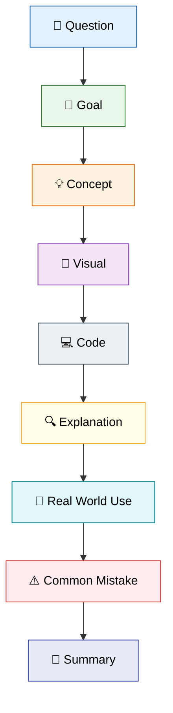

---

# 📘 **Experiment 01**

## **Python Installation & Getting Started**

---

### 📖 Overview

In this experiment, you'll learn how to install Python, understand the difference between Interactive and Script Mode, and write your first Python program.

---

### 🎯 Learning Objectives

- Install Python
- Understand Interactive Mode
- Understand Script Mode
- Execute Python programs
- Use Jupyter Notebook

---

### 📚 Topics Covered

- Python Installation
- Interactive Programming
- Script Programming
- print()
- Comments
- Variables
- Input & Output

---

### 🎓 Expected Outcome

After completing this experiment, you'll be able to write, execute, and understand basic Python programs.

---

# 📌 Question 1

> **Install Python and understand the difference between Interactive Mode and Script Mode in IDLE.**

## 🎯 Goal

After completing this question, you will be able to:

- Verify that Python is installed on your system.
- Check the installed Python version.
- Understand the difference between Interactive Mode and Script Mode.
- Know when to use each mode.

## 💡 Concept

Python provides **two ways to execute programs**:

- **Interactive Mode:** Executes one statement at a time and displays the output immediately. It is ideal for learning, testing, and debugging.

- **Script Mode:** Executes an entire Python program saved in a `.py` file. It is best suited for developing complete applications and assignments.

## 🧠 Visual

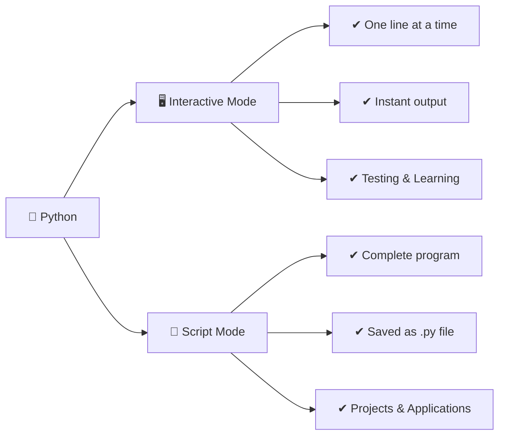

## 💻 Implementation


```python
import sys

print("Python is installed.")
print("Version:", sys.version)
```

    Python is installed.
    Version: 3.13.5 | packaged by Anaconda, Inc. | (main, Jun 12 2025, 16:37:03) [MSC v.1929 64 bit (AMD64)]
    

## 🔍 Explanation

- `import sys` imports Python's built-in **sys** module.
- `sys.version` displays the installed Python version.
- `print()` is used to display information on the screen.
- If the Python version is displayed successfully, it confirms that Python has been installed correctly.

## 🚀 Real World Use

| Mode | Used For |
|------|----------|
| 🖥️ Interactive Mode | Learning Python, testing code snippets, and debugging programs. |
| 📄 Script Mode | Developing applications, automating tasks, performing data analysis, and writing Python projects. |

## ⚠️ Common Mistakes

- Forgetting to save the `.py` file before running it.
- Confusing Interactive Mode with Script Mode.
- Assuming `sys.version` installs Python instead of displaying its version.
- Running Python code in the wrong environment or interpreter.

## 📝 Summary

- Python programs can be executed in **Interactive Mode** or **Script Mode**.
- Interactive Mode runs one statement at a time.
- Script Mode runs the complete program stored in a `.py` file.
- `sys.version` is used to check the installed Python version.
- Script Mode is the preferred choice for writing complete Python programs.

***

# 📌 Question 2

>Write Python programs to print strings in the given manner.

## 🎯 Goal

After completing this question, you will be able to:

- Understand how to use the `print()` function.
- Print text on the screen using string literals.
- Display output on a single line and multiple lines.
- Use escape sequences like `\n` for formatting.

## 💡 Concept

The `print()` function is one of the most commonly used functions in Python. It is used to display text, numbers, variables, and other data on the screen.

A **string** is a sequence of characters enclosed in single (`' '`) or double (`" "`) quotes.

Python also supports **escape sequences**, such as `\n`, to format the output by inserting a new line.

## 🧠 Visual

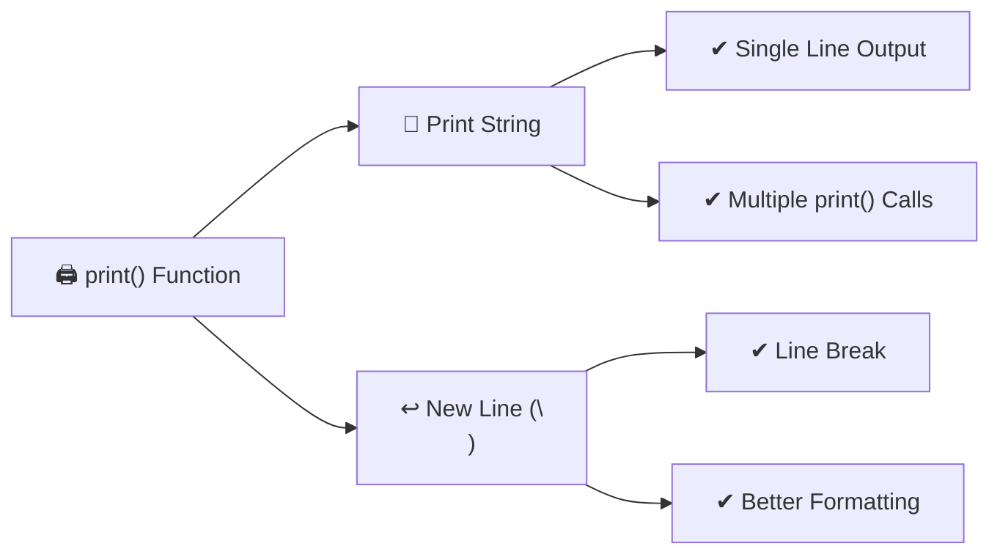

## 💻 Implementation


```python
# 2(a)
# print("Hello Everyone !!!")
print("Hello sir have a good day greeting by Ravi")

# 2(b)
# print("Hello")
# print("World")
print("hello")
print("Sir")

# 2(c)
# print("Hello\nWorld")
print("Hello\nSir")

# 2(d)
# print("Rohit's date of birth is 12\05\1999")
print("My DOB is 30th of april 2002")
```

    Hello sir have a good day greeting by Ravi
    hello
    Sir
    Hello
    Sir
    My DOB is 30th of april 2002
    

## 🔍 Explanation

- `print()` displays the given output on the screen.
- Text enclosed within quotes is treated as a **string**.
- Each `print()` statement automatically moves the cursor to the next line after printing.
- The `\n` escape sequence inserts a new line within the same `print()` statement.

## 🚀 Real World Use

| Feature | Used For |
|---------|----------|
| `print()` | Displaying messages, results, and debugging information. |
| Strings | Showing names, addresses, notifications, and user-friendly text. |
| `\n` | Formatting reports, invoices, logs, and console output. |

## ⚠️ Common Mistakes

- Forgetting quotation marks around strings.
- Missing a closing quotation mark.
- Writing `\n` outside a string.
- Confusing multiple `print()` statements with the `\n` escape sequence.

## 📝 Summary

- `print()` is used to display output in Python.
- Strings must be enclosed within quotation marks.
- Multiple `print()` statements print on separate lines.
- The `\n` escape sequence creates a new line within a single string.
- Proper formatting makes program output more readable.

***

# 📌 Question 2

>**Declare a string variable called `x` and assign it the value `Hello`. Print the value of `x`.**

## 🎯 Goal

After completing this question, you will be able to:

- Understand what a variable is.
- Declare a string variable in Python.
- Assign a value to a variable.
- Display the value of a variable using the `print()` function.

## 💡 Concept

A **variable** is a named storage location used to store data in memory. In Python, a variable is created automatically when a value is assigned to it.

A **string** is a sequence of characters enclosed in single (`' '`) or double (`" "`) quotation marks.

Variables make programs more flexible because the stored value can be reused or updated whenever needed.

## 🧠 Visual

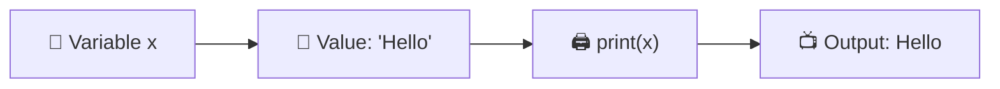

## 💻 Implementation


```python
x="Hello"
print(x)
```

    Hello
    

## 🔍 Explanation

- `x = "Hello"` creates a variable named **x** and stores the string **"Hello"**.
- `print(x)` retrieves the value stored in the variable and displays it on the screen.
- The variable name is **not** enclosed in quotation marks when printing its value.

## 🚀 Real World Use

| Feature | Used For |
|---------|----------|
| Variables | Storing names, marks, prices, IDs, and other data. |
| Strings | Displaying messages, labels, and user information. |
| `print()` | Showing the stored data to the user. |

## ⚠️ Common Mistakes

- Writing `print("x")` instead of `print(x)`.
- Forgetting quotation marks while assigning a string.
- Using a variable before assigning it a value.
- Using different variable names, such as assigning to `x` but printing `X`.

## 📝 Summary

- A variable stores data in memory.
- Strings are enclosed in quotation marks.
- Values are assigned using the `=` operator.
- `print()` displays the value stored in a variable.
- Variables make Python programs reusable and easier to maintain.|

---

# 📌 Question 4

>**Take different data types and print values using the `print()` function.**

## 🎯 Goal

After completing this question, you will be able to:

- Understand the basic data types in Python.
- Declare variables of different data types.
- Display different types of values using the `print()` function.
- Identify the appropriate data type for different kinds of information.

## 💡 Concept

Python supports different **data types** to store different kinds of information.

Some commonly used data types are:

- **String (`str`)** → Stores text.
- **Integer (`int`)** → Stores whole numbers.
- **Float (`float`)** → Stores decimal numbers.
- **Boolean (`bool`)** → Stores logical values (`True` or `False`).

The `print()` function can display values of all these data types.

## 🧠 Visual

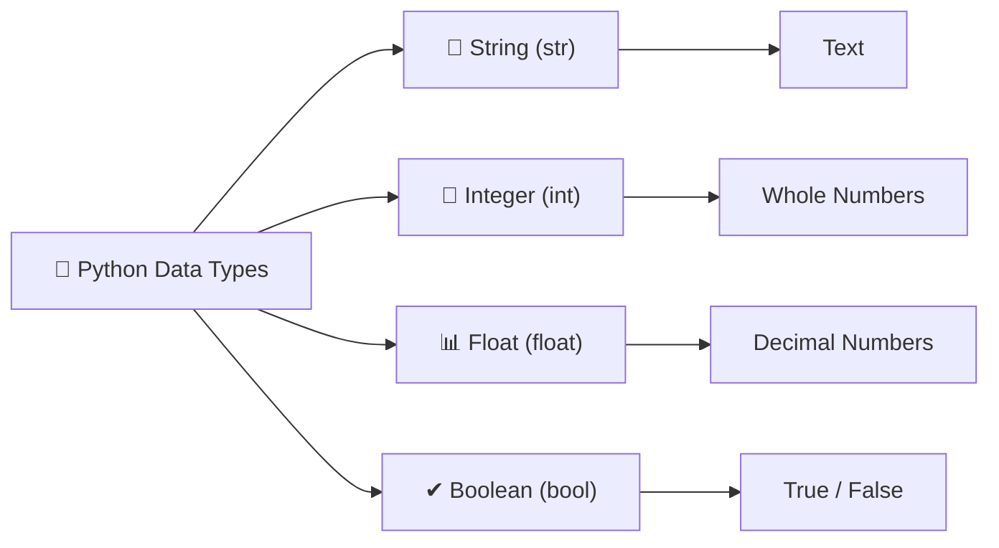

## 💻 Implementation


```python
integer=58
decimal=21.22
text="text value"
boolean=True
lst=["a","b","c"]

print(integer,decimal,text,boolean,lst,sep="\n")
```

    58
    21.22
    text value
    True
    ['a', 'b', 'c']
    

## 🔍 Explanation

- `name` stores a **string** value.
- `age` stores an **integer** value.
- `height` stores a **float** (decimal) value.
- `is_student` stores a **boolean** value.
- The `print()` function displays each variable along with its value.

## 🚀 Real World Use

| Data Type | Used For |
|-----------|----------|
| String (`str`) | Names, addresses, messages, email IDs |
| Integer (`int`) | Age, marks, quantity, roll numbers |
| Float (`float`) | Height, weight, price, percentage |
| Boolean (`bool`) | Login status, eligibility, pass/fail conditions |

## ⚠️ Common Mistakes

- Forgetting quotation marks around string values.
- Writing decimal numbers as strings instead of floats.
- Using `true` or `false` instead of `True` or `False` (Python is case-sensitive).
- Mixing different data types without understanding their purpose.

## 📝 Summary

- Python provides different data types to store different kinds of information.
- `str` stores text.
- `int` stores whole numbers.
- `float` stores decimal numbers.
- `bool` stores logical values (`True` or `False`).
- The `print()` function can display values of any data type.

***

# 📌 Question 5

>**Take two variables `a` and `b`. Assign your first name and last name. Print your full name by adding both.**

## 🎯 Goal

After completing this question, you will be able to:

- Understand how to declare multiple variables.
- Store text using string variables.
- Combine two strings using the `+` operator.
- Display the combined result using the `print()` function.

## 💡 Concept

In Python, multiple variables can store different pieces of information. When two string variables are combined using the **`+` (concatenation) operator**, they form a single string.

This process is called **string concatenation**.

## 🧠 Visual

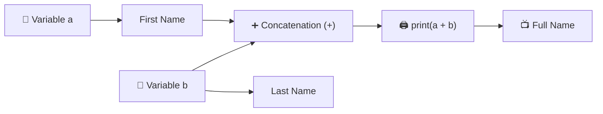

## 💻 Implementation


```python
a="Ravinder"
b="Singh"
print(a+b)
```

    RavinderSingh
    

## 🔍 Explanation

- `a` stores the first name.
- `b` stores the last name.
- The `+` operator joins the two strings together.
- `print()` displays the combined full name on the screen.

## 🚀 Real World Use

| Feature | Used For |
|---------|----------|
| Variables | Storing user information such as names and addresses. |
| String Concatenation (`+`) | Creating full names, email messages, file paths, and formatted text. |
| `print()` | Displaying the final output to the user. |

## ⚠️ Common Mistakes

- Forgetting quotation marks around string values.
- Forgetting to include a space between the first and last name while concatenating.
- Using undefined variables.
- Trying to concatenate incompatible data types without conversion.

## 📝 Summary

- Variables store individual pieces of data.
- Strings can be combined using the `+` operator.
- Combining strings is called **string concatenation**.
- `print()` displays the concatenated result.
- String concatenation is commonly used to build meaningful text from multiple values.

---

# 📌 Question 6

>**Declare first name, last name, and nickname. Print the output in the following format:**

**FirstName (Nickname) LastName** 

## 🎯 Goal

After completing this question, you will be able to:

- Declare multiple string variables.
- Store first name, nickname, and last name separately.
- Combine multiple strings into a single formatted output.
- Display the formatted text using the `print()` function.

## 💡 Concept

Python allows multiple string variables to be combined into a meaningful output.

Using the **`+` (concatenation) operator**, strings, spaces, and special characters like parentheses `()` can be joined to create a well-formatted message.

This technique is commonly used to display names, addresses, and other formatted text.

## 🧠 Visual

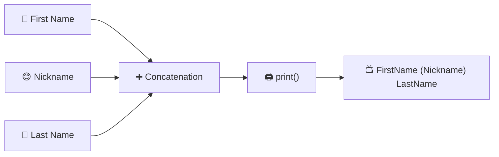

## 💻 Implementation


```python
first_name=a
last_name=b
nickname="(Ravi)"
print(first_name,nickname,last_name,sep=" ")
```

    Ravinder (Ravi) Singh
    

## 🔍 Explanation

- Three string variables store the first name, nickname, and last name.
- Parentheses `()` and spaces are added as strings to format the output.
- The `+` operator joins all parts into one complete string.
- `print()` displays the formatted name on the screen.

## 🚀 Real World Use

| Feature | Used For |
|---------|----------|
| Multiple Variables | Storing different pieces of user information. |
| String Concatenation | Creating full names, usernames, and formatted text. |
| Formatted Output | Displaying names in applications, certificates, profiles, and reports. |

## ⚠️ Common Mistakes

- Forgetting quotation marks around string values.
- Missing spaces while concatenating strings.
- Forgetting to include the parentheses around the nickname.
- Using an undefined variable in the `print()` statement.

## 📝 Summary

- Multiple string variables can be combined into one output.
- The `+` operator is used for string concatenation.
- Parentheses and spaces can be added as string literals for formatting.
- `print()` displays the final formatted text.
- Proper formatting improves the readability of program output.

----

# 📌 Question 7

> **Declare and assign suitable variables, then print the details in the required format.**

## 🎯 Goal

After completing this question, you will be able to:

- Declare multiple variables to store different types of information.
- Assign appropriate values to each variable.
- Display the stored information in a structured format.
- Improve program readability using meaningful variable names.

## 💡 Concept

Variables allow us to store different pieces of related information separately.

By assigning meaningful values to multiple variables and printing them together, we can organize and display data in a clear and readable format.

This approach makes programs easier to understand, modify, and reuse.

## 🧠 Visual

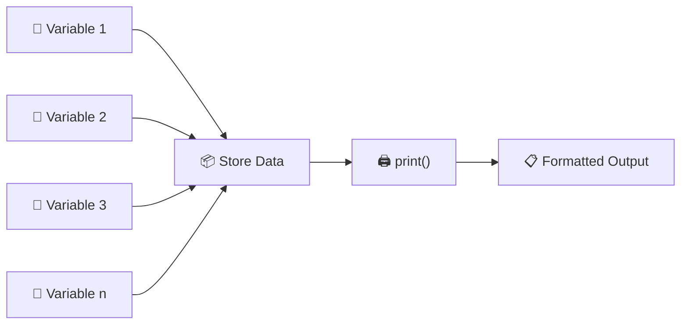

## 💻 Implementation


```python
sap="590030651"
dob="30th April 2002"
add="UPES"
program="MCA"
sem="1"

print(f" Hi my name is {a} {b} and my date of birth is {dob}.\n I am pursuing {program} from {add} and this is my semester {sem} ")

#Thats how you write it without the f string too much of task. 
print()
print("Hi my name is", a, b, "and my date of birth is", dob)
print("I am pursuing", program, "from", add, "and this is my semester", sem)
```

     Hi my name is Ravinder Singh and my date of birth is 30th April 2002.
     I am pursuing MCA from UPES and this is my semester 1 
    
    Hi my name is Ravinder Singh and my date of birth is 30th April 2002
    I am pursuing MCA from UPES and this is my semester 1
    

## 🔍 Explanation

- Each variable stores a specific piece of information.
- Meaningful variable names improve code readability.
- The `print()` function displays all stored values in the required format.
- Organizing data into variables makes the program easier to update and maintain.

## 🚀 Real World Use

| Feature | Used For |
|---------|----------|
| Variables | Storing student, employee, or customer details. |
| Multiple Variables | Managing related information such as name, age, address, and contact details. |
| Formatted Output | Generating reports, profiles, receipts, and application forms. |

## ⚠️ Common Mistakes

- Using unclear or meaningless variable names.
- Assigning the wrong value to a variable.
- Printing variables in the wrong order.
- Forgetting to initialize a variable before using it.

## 📝 Summary

- Variables help organize related information.
- Each variable should have a meaningful name.
- `print()` is used to display the stored values.
- Well-structured output improves readability.
- Using variables makes programs easier to maintain and reuse.|

---

---

## **🧪 Experiment 2**

## **Use of Input Statements and Operators**

## 📝 Overview

This experiment introduces the fundamentals of Python programming through simple mathematical and logical problems. It focuses on using variables, arithmetic operators, mathematical formulas, and user input to solve real-world calculations. These exercises help build a strong foundation in Python syntax, problem-solving, and computational thinking.

## 🎯 Learning Objectives

- Understand variable declaration and data types in Python.
- Perform arithmetic operations using operators and formulas.
- Develop Python programs to solve basic mathematical problems.
- Practice writing, executing, and interpreting Python programs.

## 📚 Topics Covered

- Variables and Data Types
- Arithmetic Operators
- Mathematical Expressions and Formulas
- User Input and Output
- Type Conversion
- Basic Problem Solving

## ✅ Expected Outcome

By the end of this experiment, learners will be able to write Python programs that perform arithmetic calculations, implement mathematical formulas, accept user input, and solve basic real-world computational problems confidently.

---

# 📌 Question 1

> **Declare integer variables `x`, `y`, and `z`. Assign `x = 9`, `y = 7`, perform arithmetic operations, and print the results.**

## 🎯 Goal

Understand how to declare variables and perform basic arithmetic operations using Python.

## 💡 Concept

Variables are used to store data in memory. Python provides arithmetic operators to perform mathematical calculations on these values.

### Arithmetic Operators

| Operator | Description | Example |
|:---------:|-------------|---------|
| `+` | Addition | `x + y` |
| `-` | Subtraction | `x - y` |
| `*` | Multiplication | `x * y` |
| `/` | Division | `x / y` |
| `//` | Floor Division | `x // y` |
| `%` | Modulus (Remainder) | `x % y` |
| `**` | Exponentiation | `x ** y` |

## 🧠 Visual

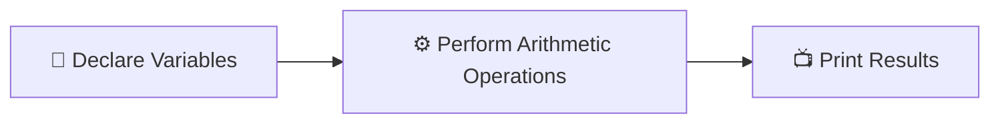

## 💻 Implementation


```python
x,y,z=9,7,10
print(f" Add: {x+y+z} \n Sub: {x+z-y} \n Multiply: {x*y*z} \n Divide:{x/y/z}" )
```

     Add: 26 
     Sub: 12 
     Multiply: 630 
     Divide:0.1285714285714286
    

## 📝 Explanation

- Integer variables are initialized with predefined values.
- Arithmetic operations are performed using Python operators.
- Each operation produces a different mathematical result.
- The output is displayed using formatted print statements for better readability.
- This example demonstrates the basic use of variables and operators in Python.

## 🌍 Real World Use

- Performing calculations in billing systems.
- Calculating marks and grades.
- Financial and accounting applications.
- Scientific and engineering computations.
- Building calculators and educational software.

## ⚠️ Common Mistakes

- Using variables before assigning values.
- Confusing `/` with `//`.
- Using the wrong arithmetic operator.
- Forgetting parentheses in complex expressions.
- Incorrect indentation or syntax in print statements.

## 📚 Summary

- Variables store values used in calculations.
- Arithmetic operators perform mathematical operations.
- Python supports several operators for different types of calculations.
- Formatted output makes program results easier to understand.

---

# 📌 Question 2

> Write a Python program to calculate the area of a circle.

## 🎯 Goal

Learn how to calculate the area of a circle by applying a mathematical formula in Python.

## 💡 Concept

The area of a circle is the space enclosed within its boundary. It is calculated using the formula:

**Area = π × r²**

Where:

| Symbol | Meaning |
|:------:|---------|
| `π` | Mathematical constant (≈ 3.14159) |
| `r` | Radius of the circle |
| `r²` | Radius × Radius |

## 🧠 Visual

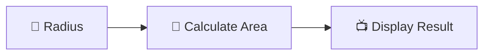

## 💻 Implementation


```python
import math
radius=float(input("Enter the radius :"))
print(f"radius is {radius}\narera is {math.pi *(radius*radius)}")

```

    radius is 8.5
    arera is 226.98006922186255
    

## 📝 Explanation

- The program accepts or defines the radius of the circle.
- It uses the formula **π × r²** to calculate the area.
- The value of π is obtained from Python's `math` module for better accuracy.
- The calculated area is displayed in a readable format.
- This example demonstrates how mathematical formulas are implemented in Python.

## 🌍 Real World Use

- Designing circular parks and gardens.
- Calculating the area of pipes and tanks.
- Construction and civil engineering projects.
- Manufacturing circular objects such as wheels and gears.
- Graphics and game development involving circular shapes.

## ⚠️ Common Mistakes

- Forgetting to import the `math` module.
- Using the diameter instead of the radius.
- Writing `2πr` (circumference) instead of `πr²` (area).
- Using `^` instead of `**` for exponentiation.
- Forgetting to square the radius.

## 📚 Summary

- The area of a circle is calculated using **πr²**.
- Python provides an accurate value of π through the `math` module.
- Exponentiation is performed using the `**` operator.
- Mathematical formulas can be implemented easily using Python.

---

# 📌 Question 3

> Write a Python program to calculate the value of **(x + y)*(x+y)**.

## 🎯 Goal

Learn how to evaluate mathematical expressions in Python using variables and arithmetic operators.

## 💡 Concept

Python can perform mathematical calculations by combining variables with arithmetic operators.

The formula for the square of the sum of two numbers is:

**(x + y)² = (x + y) × (x + y)**

Where:

| Symbol | Meaning |
|:------:|---------|
| `x` | First number |
| `y` | Second number |
| `²` | Square of a value |

## 🧠 Visual
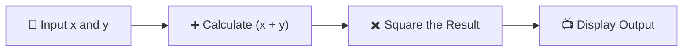

## 💻 Implementation


```python
x,y=map(float,input("enter the value of x and y seprated by space").split())
print(f"value of x is {x}\nvalue of y is {y}\n result is {(x+y)*(x+y)}")
```

    value of x is 20.0
    value of y is 35.0
     result is 3025.0
    

## 📝 Explanation

- The program accepts two numbers (`x` and `y`) from the user in a single line using the `input()` function.
- The `map(float, ...)` function converts both input values into floating-point numbers.
- The expression `(x + y) * (x + y)` is used to calculate the value of **(x + y)²**.
- The values of `x`, `y`, and the calculated result are displayed using an **f-string** for better readability.
- This program demonstrates how user input, arithmetic operations, and formatted output work together in Python.

## 🌍 Real World Use

- Solving algebraic expressions.
- Performing scientific and engineering calculations.
- Building educational applications for mathematics.
- Learning operator precedence in programming.
- Developing calculator-based applications.

## ⚠️ Common Mistakes

- Forgetting to separate the two input values with a space.
- Using `^` instead of `**` for exponentiation.
- Omitting parentheses around `(x + y)`, which changes the result.
- Entering non-numeric values, causing a conversion error.

## 📚 Summary

- `input()` accepts values entered by the user.
- `map(float, ...)` converts multiple inputs into numbers.
- `(x + y) * (x + y)` calculates the square of the sum.
- **f-strings** provide a clean and readable way to display the output.

---

# 📌 Question 4

> Write a Python program to display the values of two variables Test data: `x = 4`, `y = 3`.

## 🎯 Goal

Learn how to declare variables and display their values using formatted output in Python.

## 💡 Concept

Variables are used to store data that can be accessed and displayed whenever required. Python's **f-string** provides a simple and readable way to format output.

### Components Used

| Component | Purpose |
|:---------:|---------|
| Variable | Stores a value in memory |
| `print()` | Displays output on the screen |
| `f-string` | Inserts variable values into a string |
| `\n` | Prints output on a new line |

## 🧠 Visual

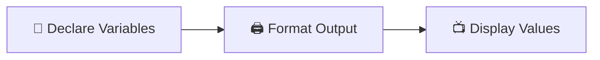

## 💻 Implementation


```python
x,y=4,3
print(f"value of x is {x}\nvalue of y is {y}")
```

    value of x is 4
    value of y is 3
    

## 📝 Explanation

- The variables `x` and `y` are initialized with the values `4` and `3`.
- An **f-string** is used to insert the values of the variables into the output.
- The newline character (`\n`) prints each value on a separate line.
- The program displays the values in a clear and readable format.
- This example demonstrates variable declaration and formatted output in Python.

## 🌍 Real World Use

- Displaying employee or student details.
- Showing product information in billing systems.
- Printing user profile information.
- Displaying configuration or system settings.
- Creating readable console-based applications.

## ⚠️ Common Mistakes

- Forgetting the `f` before the string.
- Misspelling variable names inside `{}`.
- Omitting the newline character when separate lines are required.
- Using variables before assigning values.

## 📚 Summary

- Variables store data that can be displayed later.
- `print()` is used to display output in Python.
- **f-strings** make output formatting simple and readable.
- `\n` helps organize output across multiple lines.

----

# 📌 Question 5

> Display the expected output (`49`) and compare it with the actual result.

## 🎯 Goal

Learn how to compare an expected result with the program's actual output using formatted printing.

## 💡 Concept

When testing a program, it is a good practice to compare the **expected output** with the **actual output**. This helps verify whether the program is producing the correct result.

### Key Components

| Component | Purpose |
|:---------:|---------|
| Expected Output | The result you expect from the program |
| Actual Output | The result produced by the program |
| `print()` | Displays both values |
| `f-string` | Formats the output clearly |

## 🧠 Visual

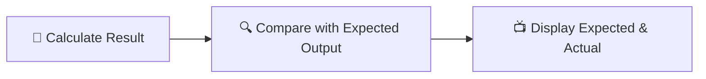

## 💻 Implementation


```python
print(f"Expected : 49\nActual : {(x+y)*(x+y)} ")
```

    Expected : 49
    Actual : 49 
    

## 📝 Explanation

- The program calculates the value of **(x + y) × (x + y)** using the existing values of `x` and `y`.
- It displays the **expected output** (`49`) alongside the **actual calculated result**.
- An **f-string** is used to format both values in a readable way.
- This comparison helps verify that the program is working correctly.
- The program demonstrates a simple technique for validating program output.

## 🌍 Real World Use

- Testing mathematical programs.
- Verifying program correctness during debugging.
- Comparing expected and actual results in unit testing.
- Checking outputs while learning programming.
- Validating calculations in educational applications.

## ⚠️ Common Mistakes

- Using incorrect variable values before testing.
- Forgetting to update the expected output after changing the program.
- Comparing against an incorrect expected value.
- Omitting the `f` before an f-string.

## 📚 Summary

- Expected and actual outputs help verify program correctness.
- Formatted output makes comparisons easy to read.
- Testing results is an important part of programming.
- Simple output validation helps identify errors early.

----

# 📌 Question 6

> Compute the hypotenuse `c` of a right triangle using the Pythagoras theorem.

## 🎯 Goal

Learn how to apply the Pythagoras theorem in Python to calculate the hypotenuse of a right triangle.

## 💡 Concept

The **Pythagoras theorem** states that the square of the hypotenuse is equal to the sum of the squares of the other two sides.

**Formula = c = √(a² + b²)**

Where:

| Symbol | Meaning |
|:------:|---------|
| `a` | First side of the triangle |
| `b` | Second side of the triangle |
| `c` | Hypotenuse (Longest side) |

## 🧠 Visual

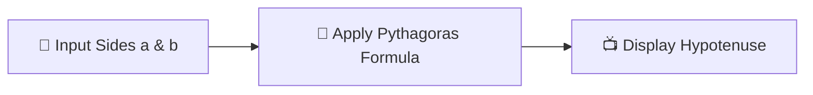

## 💻 Implementation


```python
a,b=map(float,input("enter two sides seprated by space :").split())
print(f"value of side are {a},{b}\nHypotneuse is {((a*a)+(b*b))**0.5}")
```

    value of side are 10.0,20.0
    Hypotneuse is 22.360679774997898
    

## 📝 Explanation

- The program accepts the lengths of two sides (`a` and `b`) from the user in a single line.
- The `map(float, ...)` function converts both input values into floating-point numbers.
- It calculates the hypotenuse using the expression `((a*a) + (b*b)) ** 0.5`, where `**0.5` represents the square root.
- The values of `a`, `b`, and the calculated hypotenuse are displayed using an **f-string**.
- This program demonstrates how mathematical formulas can be implemented using arithmetic operators in Python.

## 🌍 Real World Use

- Calculating distances in surveying and construction.
- Finding diagonal lengths in architecture.
- Navigation and GPS calculations.
- Computer graphics and game development.
- Engineering and physics applications.

## ⚠️ Common Mistakes

- Entering the two side lengths without separating them by a space.
- Using invalid or negative values for the triangle sides.
- Forgetting that `**0.5` calculates the square root.
- Using incorrect arithmetic operators in the formula.

## 📚 Summary

- The Pythagoras theorem is used to find the hypotenuse of a right triangle.
- `map(float, ...)` converts multiple user inputs into numeric values.
- The square root is calculated using `**0.5`.
- **f-strings** provide a clean and readable output format.

---

# 📌 Question 7

> Write a Python program to calculate **Simple Interest**.

## 🎯 Goal

Learn how to calculate Simple Interest using user input, arithmetic operators, and Python expressions.

## 💡 Concept

**Simple Interest (SI)** is the interest earned on the original principal amount over a given period.

**Formula = SI = (P × R × T) / 100**

Where:

| Symbol | Meaning |
|:------:|---------|
| `P` | Principal Amount |
| `R` | Rate of Interest |
| `T` | Time |
| `SI` | Simple Interest |

## 🧠 Visual

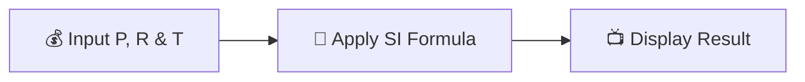

## 💻 Implementation


```python
p,r,t=map(float,input("enter pricipal rate and time in number of months seprated by space :").split())
print(f"principle is {p}\nrate is {r}\ntime is {t}\nsimple interest is {(p*r*t)/100}")
```

    principle is 1568.0
    rate is 5.0
    time is 12.0
    simple interest is 940.8
    

## 📝 Explanation

- The program accepts the **principal amount (`p`)**, **rate of interest (`r`)**, and **time (`t`)** from the user in a single line.
- The `map(float, ...)` function converts all three input values into floating-point numbers.
- The Simple Interest is calculated using the formula **(p × r × t) / 100**.
- An **f-string** is used to display the principal, rate, time, and the calculated Simple Interest in a readable format.
- This program demonstrates how Python can perform financial calculations using arithmetic operators.

## 🌍 Real World Use

- Calculating interest on bank deposits.
- Estimating interest on personal loans.
- Financial planning and budgeting.
- Educational applications for learning finance.
- Banking and accounting software.

## ⚠️ Common Mistakes

- Entering the values without separating them by spaces.
- Using incorrect values for principal, rate, or time.
- Forgetting to divide the result by `100`.
- Entering text instead of numeric values.

## 📚 Summary

- `map(float, ...)` converts multiple user inputs into numbers.
- Simple Interest is calculated using **(P × R × T) / 100**.
- Arithmetic operators make financial calculations easy.
- **f-strings** present the output in a clear and readable format.

---

# 📌 Question 8

> Write a Python program to calculate the area of a triangle using **Heron's Formula**.

## 🎯 Goal

Learn how to calculate the area of a triangle using Heron's Formula with user input and arithmetic operations.

## 💡 Concept

Heron's Formula is used to calculate the area of a triangle when the lengths of all three sides are known.

**Semi-perimeter (s) = (a + b + c) / 2**

**Area = √(s × (s − a) × (s − b) × (s − c))**

Where:

| Symbol | Meaning |
|:------:|---------|
| `a` | First side |
| `b` | Second side |
| `c` | Third side |
| `s` | Semi-perimeter |
| `Area` | Area of the triangle |

## 🧠 Visual

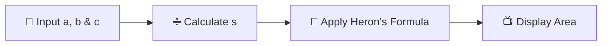

## 💻 Implementation


```python
a,b,c=map(float,input("enter three side seprated by space").split())
if (a+b>c) and (a+c>b) and (b+c>a):
    s=(a+b+c)/2
    area=(s*(s-a)*(s-b)*(s-c))**0.5
    print(f"sides are {a},{b},{c}\narea is {area}")
else:
    print("not valid sides")

```

    sides are 5.0,12.0,13.0
    area is 30.0
    

## 📝 Explanation

- The program accepts the lengths of the three sides (`a`, `b`, and `c`) from the user.
- It calculates the **semi-perimeter** using the formula **(a + b + c) / 2**.
- The area is then computed using **Heron's Formula**.
- The square root is calculated using the exponent operator `**0.5`.
- Finally, the program displays the three side lengths and the calculated area using an **f-string**.

## 🌍 Real World Use

- Calculating land or plot areas.
- Construction and civil engineering.
- Architecture and structural design.
- Surveying measurements.
- Educational mathematics applications.

## ⚠️ Common Mistakes

- Entering side lengths that cannot form a triangle.
- Forgetting to calculate the semi-perimeter before the area.
- Using incorrect arithmetic operators in the formula.
- Entering non-numeric values instead of numbers.

## 📚 Summary

- Heron's Formula calculates the area using only the three side lengths.
- The semi-perimeter is calculated first.
- The square root is obtained using `**0.5`.
- Python makes geometric calculations simple using arithmetic operators and variables.

---

# 📌 Question 9

> Write a Python program to convert a given number of seconds into **hours, minutes, and remaining seconds**.

## 🎯 Goal

Learn how to convert time from seconds into hours, minutes, and seconds using arithmetic and floor division operators.

## 💡 Concept

Time conversion can be performed using **floor division (`//`)** and the **modulus operator (`%`)**.

### Formulas

- **Hours = Total Seconds // 3600**
- **Minutes = (Total Seconds % 3600) // 60**
- **Seconds = Total Seconds % 60**

### Components Used

| Component | Purpose |
|:---------:|---------|
| `//` | Calculates the whole quotient |
| `%` | Finds the remaining value |
| `input()` | Accepts total seconds from the user |
| `print()` | Displays the converted time |

## 🧠 Visual

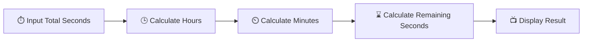

## 💻 Implementation


```python
total=int(input("enter total second "))
print(f"total second : {total}\nhours:{total//3600}\nminutes:{((total%3600)//60)}\nseconds:{total%60} ")

```

    total second : 7564
    hours:2
    minutes:6
    seconds:4 
    

## 📝 Explanation

- The program accepts the total number of seconds from the user.
- Floor division (`//`) is used to calculate the number of complete hours.
- The modulus operator (`%`) finds the remaining seconds after removing the hours.
- The remaining seconds are converted into minutes, and the leftover value becomes the final seconds.
- An **f-string** displays the total seconds, hours, minutes, and remaining seconds in a clear format.

## 🌍 Real World Use

- Digital clocks and timers.
- Stopwatch applications.
- Video and audio duration conversion.
- Sports timing systems.
- Time management software.

## ⚠️ Common Mistakes

- Using `/` instead of `//` for whole-number calculations.
- Forgetting to use `%` before calculating minutes.
- Using incorrect conversion values instead of `3600` and `60`.
- Entering non-integer values for total seconds.

## 📚 Summary

- `//` calculates complete hours and minutes.
- `%` determines the remaining seconds after each conversion.
- Time conversion is a practical application of arithmetic operators.
- Python can efficiently convert seconds into a readable time format.

---

# 📌 Question 10

> Swap two numbers without using an additional variable.

## 🎯 Goal

Learn how to swap the values of two variables using **tuple unpacking (multiple assignment)** in Python without using a temporary variable.

## 💡 Concept

Python provides a simple and efficient way to exchange the values of two variables using **tuple unpacking**.

**Syntax**

**a, b = b, a**

This statement swaps the values of `a` and `b` in a single line.

### Components Used

| Component | Purpose |
|:---------:|---------|
| Variable | Stores a value |
| Tuple Unpacking | Swaps multiple values simultaneously |
| `print()` | Displays values before and after swapping |
| `f-string` | Formats the output |

## 🧠 Visual

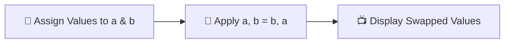

## 💻 Implementation


```python
a,b=35,67
print(f"before swap: {a},{b}")
a,b=b,a
print(f"after swap: {a},{b}")
```

    before swap: 35,67
    after swap: 67,35
    

## 📝 Explanation

- The variables `a` and `b` are initialized with the values `35` and `67`.
- The program first displays the original values using an **f-string**.
- The statement `a, b = b, a` performs **tuple unpacking (multiple assignment)** to swap the values without using a temporary variable.
- After swapping, the updated values are displayed to verify the exchange.
- This approach is concise, readable, and is the preferred method for swapping values in Python.

## 🌍 Real World Use

- Swapping two numbers during algorithm implementation.
- Exchanging the values of two strings or lists.
- Rearranging multiple variables in a single statement.
- Unpacking tuples or lists into individual variables.
- Writing cleaner and more efficient Python code.

## ⚠️ Common Mistakes

- Using `=` instead of `,` in the assignment.
- Forgetting to print the values before and after swapping.
- Assuming tuple unpacking creates a temporary variable—it does not require one in your code.
- Confusing tuple unpacking with traditional swapping methods used in other programming languages.

## 📚 Summary

- Python swaps variables using **tuple unpacking**.
- `a, b = b, a` exchanges values in a single statement.
- No additional variable is required.
- This technique is simple, efficient, and widely used in Python programming.

---

# 📌 Question 11

> Find the sum of the first `n` natural numbers.

## 🎯 Goal

Learn how to calculate the sum of the first `n` natural numbers using a mathematical formula in Python.

## 💡 Concept

The sum of the first `n` natural numbers can be calculated directly using a formula instead of adding each number one by one.

**Formula = Sum = n × (n + 1) / 2**

Where:

| Symbol | Meaning |
|:------:|---------|
| `n` | Number of natural numbers |
| `Sum` | Total of the first `n` natural numbers |

Using this formula makes the calculation fast and efficient.

## 🧠 Visual

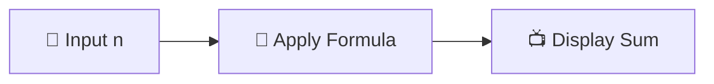

## 💻 Implementation


```python
n=int(input("enter n"))
summ=n*(n+1)//2
print(f"sum of first {n} natural number is {summ}")
```

    sum of first 15 natural number is 120
    

## 📝 Explanation

- The program accepts the value of `n` from the user using the `input()` function.
- The input is converted into an integer using `int()`.
- The sum of the first `n` natural numbers is calculated using the formula `n * (n + 1) // 2`.
- The floor division operator (`//`) ensures the result is an integer.
- The final result is displayed using an **f-string** in a clear and readable format.

## 🌍 Real World Use

- Solving mathematical and competitive programming problems.
- Calculating cumulative values in statistics.
- Learning mathematical optimization techniques.
- Educational software for arithmetic calculations.
- Building efficient algorithms without using loops.

## ⚠️ Common Mistakes

- Using `/` instead of `//` when an integer result is expected.
- Forgetting to convert the input to an integer.
- Omitting parentheses around `(n + 1)`.
- Entering a non-numeric value, which causes an input error.

## 📚 Summary

- The formula **n × (n + 1) / 2** efficiently calculates the sum of the first `n` natural numbers.
- `int()` converts the user input into an integer.
- `//` returns an integer result after division.
- Using a formula is faster and more efficient than adding numbers one by one.

---

# 📌 Question 12

> Print the truth table for the bitwise operators **AND (`&`)**, **OR (`|`)**, and **XOR (`^`)**.

## 🎯 Goal

Learn how bitwise operators work by generating their truth table for all possible combinations of binary values.

## 💡 Concept

Bitwise operators perform operations on the binary representation of numbers. In this program, the values `0` and `1` are used to demonstrate their behavior.

### Truth Table

| a | b | a & b | a \| b | a ^ b |
|:-:|:-:|:-----:|:------:|:------:|
| 0 | 0 |   0   |    0   |    0   |
| 0 | 1 |   0   |    1   |    1   |
| 1 | 0 |   0   |    1   |    1   |
| 1 | 1 |   1   |    1   |    0   |

### Operators Used

| Operator | Meaning |
|:--------:|---------|
| `&` | Bitwise AND |
| `\|` | Bitwise OR |
| `^` | Bitwise XOR (Exclusive OR) |

## 🧠 Visual

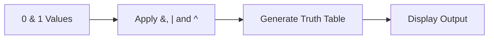

## 💻 Implementation


```python
print("a b | a&b a|b a^b")
for a in (0, 1):
    for b in (0, 1):
        print(a, b, "|", a & b, " ", a | b, " ", a ^ b)
```

    a b | a&b a|b a^b
    0 0 | 0   0   0
    0 1 | 0   1   1
    1 0 | 0   1   1
    1 1 | 1   1   0
    

## 📝 Explanation

- The program first prints a table heading using the `print()` function.
- Two nested `for` loops generate every possible combination of binary values (`0` and `1`) for `a` and `b`.
- For each combination, the program evaluates the bitwise **AND (`&`)**, **OR (`|`)**, and **XOR (`^`)** operations.
- The results are displayed in a tabular format, making it easy to compare the behavior of each operator.
- This program demonstrates the fundamental logic behind bitwise operations in Python.

## 🌍 Real World Use

- Digital electronics and logic circuits.
- Computer architecture and processor operations.
- Bit masking and permission management.
- Data compression and encryption algorithms.
- Competitive programming and low-level programming.

## ⚠️ Common Mistakes

- Confusing bitwise operators (`&`, `|`, `^`) with logical operators (`and`, `or`).
- Forgetting that `^` represents **XOR**, not exponentiation.
- Using values other than `0` and `1` when learning truth tables.
- Mixing bitwise operations with Boolean expressions without understanding the difference.

## 📚 Summary

- Nested loops generate all possible binary input combinations.
- `&`, `|`, and `^` perform bitwise operations.
- A truth table helps visualize how each operator behaves.
- Understanding bitwise operators is important for low-level programming and logical computations.

---

# 📌 Question 13

> Find the left shift and right shift values of a given number.

## 🎯 Goal

Learn how to use the **left shift (`<<`)** and **right shift (`>>`)** bitwise operators in Python.

## 💡 Concept

Bitwise shift operators move the binary bits of a number to the left or right.

- **Left Shift (`<<`)** shifts bits to the left and multiplies the number by **2** for each shift.
- **Right Shift (`>>`)** shifts bits to the right and divides the number by **2** for each shift (discarding the remainder).

### Operators Used

| Operator | Purpose |
|:--------:|---------|
| `<<` | Left Shift |
| `>>` | Right Shift |

### Example

If **n = 20** and **shift = 3**:

- **20 << 3 = 160**
- **20 >> 3 = 2**

## 🧠 Visual

```mermaid
flowchart LR
    A["🔢 Number = 20"] --> B["⬅️ Left Shift (<<)"]
    A --> C["➡️ Right Shift (>>)"]
    B --> D["📺 Display Result"]
    C --> D
```

## 💻 Implementation


```python
n=20
shift=3
print("Number:",n)
print("Left shift by 2:",n<<shift)
print("Right shift by 2:",n>>shift)

```

    Number: 20
    Left shift by 2: 160
    Right shift by 2: 2
    

## 📝 Explanation

- The program initializes the number `n` with the value `20` and the shift count with `3`.
- The expression `n << shift` shifts the binary bits of the number to the left by three positions, effectively multiplying the value by `2³`.
- The expression `n >> shift` shifts the binary bits to the right by three positions, effectively dividing the value by `2³`.
- The original number, left shift result, and right shift result are displayed using the `print()` function.
- This program demonstrates how bitwise shift operators manipulate binary data efficiently.

## 🌍 Real World Use

- Low-level programming and embedded systems.
- Optimizing multiplication and division by powers of two.
- Bit manipulation in operating systems.
- Digital electronics and processor operations.
- Competitive programming and algorithm optimization.

## ⚠️ Common Mistakes

- Confusing left and right shift operators.
- Assuming shift operators work like normal arithmetic for all values.
- Using an incorrect shift count.
- Forgetting that the program shifts by **3** positions, even if the printed message says **2**.

## 📚 Summary

- `<<` shifts bits to the left and generally multiplies the value by powers of two.
- `>>` shifts bits to the right and generally divides the value by powers of two.
- Bitwise shift operators are efficient for binary calculations.
- Python provides simple syntax for performing bit-level operations.

---

# 📌 Question 14

> Using the membership operator, find whether a given number is present in the sequence `(10, 20, 56, 78, 89)`.

## 🎯 Goal

Learn how to use the **membership operator (`in`)** to check whether an element exists in a sequence.

## 💡 Concept

The **membership operator (`in`)** checks whether a value is present in a collection such as a tuple, list, string, or set.

If the value exists, the result is **True**; otherwise, it is **False**.

### Operator Used

| Operator | Purpose |
|:--------:|---------|
| `in` | Checks if a value exists in a sequence |

### Example

Given the tuple:

`(10, 20, 56, 78, 89)`

- `56 in seq` → **True**
- `798 in seq` → **False**

## 🧠 Visual

```mermaid
flowchart LR
    A["📦 Tuple Sequence"] --> B["🔍 Check Number using 'in'"]
    B --> C["✅ True / ❌ False"]
```

## 💻 Implementation


```python
seq=(10, 20, 56, 78, 89)
num1=56
num2=798
print(num1 in seq)
print(num2 in seq)
```

    True
    False
    

## 📝 Explanation

- The program creates a tuple named `seq` containing five integer values.
- Two variables, `num1` and `num2`, store the values `56` and `798`.
- The expression `num1 in seq` checks whether `56` is present in the tuple and returns **True**.
- The expression `num2 in seq` checks whether `798` is present in the tuple and returns **False**.
- The results are displayed using the `print()` function, demonstrating how the membership operator works.

## 🌍 Real World Use

- Checking whether a user ID exists in a database.
- Verifying whether a product is available in an inventory.
- Searching for values in lists or tuples.
- Validating keywords in text processing.
- Filtering data in Python programs.

## ⚠️ Common Mistakes

- Confusing the `in` operator with the equality operator (`==`).
- Assuming `in` returns the position of an element—it only returns `True` or `False`.
- Forgetting that membership checks are case-sensitive for strings.
- Using the operator on an incorrect data type.

## 📚 Summary

- The `in` operator checks whether a value exists in a sequence.
- It returns **True** if the element is found; otherwise, it returns **False**.
- Membership operators work with tuples, lists, strings, sets, and other collections.
- They provide a simple and efficient way to search for values in Python.

---

# 📌 Question 15

> Using the membership operator, find whether a given character is present in a string.

## 🎯 Goal

Learn how to use the **membership operator (`in`)** to check whether a character exists in a string.

## 💡 Concept

Strings in Python are sequences of characters. The **membership operator (`in`)** checks whether a specific character or substring is present in a string.

If the character exists, the result is **True**; otherwise, it is **False**.

### Operator Used

| Operator | Purpose |
|:--------:|---------|
| `in` | Checks whether a character or substring exists in a string |

### Example

Given the string:

`"Ravinder Singh"`

- `"a" in text` → **True**
- `"q" in text` → **False**

## 🧠 Visual

```mermaid
flowchart LR
    A["📝 String"] --> B["🔍 Check Character using 'in'"]
    B --> C["✅ True / ❌ False"]
```

## 💻 Implementation


```python
text="Ravinder Singh"
print("q" in text)
print("x" in text)
print(" " in text)
print("a" in text)
```

    False
    False
    True
    True
    

## 📝 Explanation

- The program stores the string `"Ravinder Singh"` in the variable `text`.
- It checks whether the characters `"q"`, `"x"`, `" "`, and `"a"` are present in the string using the **`in`** operator.
- Each membership test returns either **True** or **False** depending on whether the character exists.
- The results are displayed using the `print()` function.
- This program demonstrates how Python performs membership testing on strings.

## 🌍 Real World Use

- Searching for characters or keywords in text.
- Validating user input.
- Checking for spaces or special characters in passwords.
- Filtering text in search applications.
- Text processing and data validation.

## ⚠️ Common Mistakes

- Confusing the `in` operator with the equality operator (`==`).
- Forgetting that string membership checks are **case-sensitive**.
- Assuming `in` returns the position of a character—it only returns `True` or `False`.
- Checking for multiple characters without using a substring.

## 📚 Summary

- The `in` operator checks whether a character or substring exists in a string.
- It returns **True** if the character is found; otherwise, it returns **False**.
- Strings are sequences, so membership operations are efficient and easy to use.
- Membership operators are widely used in text processing and input validation.

---

---

# **🧪 Experiment 3**

## **Conditional Statements**

## 📝 Overview

This experiment introduces **conditional statements** in Python, which allow a program to make decisions based on different conditions. It focuses on using comparison operators, logical operators, and decision-making constructs such as `if`, `if-else`, and `if-elif-else` to solve real-world problems. Through these exercises, learners develop the ability to control program flow and implement logical decision-making in Python.

## 🎯 Learning Objectives

- Understand the concept of decision-making in Python.
- Use comparison and logical operators to evaluate conditions.
- Implement `if`, `if-else`, and `if-elif-else` statements.
- Solve real-world problems using conditional logic.
- Develop problem-solving skills through decision-based programs.

## 📚 Topics Covered

- Conditional Statements (`if`, `if-else`, `if-elif-else`)
- Comparison Operators
- Logical Operators
- Nested Conditions
- Mathematical Decision Making
- Date and Calendar Logic
- Grade Calculation
- Problem Solving Using Conditions

## ✅ Expected Outcome

By the end of this experiment, learners will be able to write Python programs that make decisions based on conditions, compare values, solve mathematical and logical problems, validate input, and implement real-world decision-making using conditional statements.

---

# 📌 Question 1

> Check whether a given number is divisible by both **3** and **5**.

## 🎯 Goal

Learn how to use the **`if-else`** statement along with the **modulus (`%`)** and **logical AND (`and`)** operators to test divisibility.

## 💡 Concept

A number is divisible by another number if the remainder after division is **0**.

To check whether a number is divisible by **both 3 and 5**, both conditions must be true.

**Condition**

`number % 3 == 0 and number % 5 == 0`

### Components Used

| Component | Purpose |
|:---------:|---------|
| `%` | Finds the remainder after division |
| `==` | Compares two values |
| `and` | Ensures both conditions are true |
| `if-else` | Executes code based on the condition |

## 🧠 Visual

```mermaid
flowchart LR
    A["🔢 Input Number"] --> B{"Divisible by 3 and 5?"}
    B -- Yes --> C["✅ Display 'Divisible'"]
    B -- No --> D["❌ Display 'Not Divisible'"]
```

## 💻 Implementation


```python
num = 45

if num % 3 == 0 and num % 5 == 0:
    print(num, "is divisible by both 3 and 5")
else:
    print(num, "is not divisible by both 3 and 5")
```

    45 is divisible by both 3 and 5
    

## 📝 Explanation

- The program accepts an integer from the user using the `input()` function.
- It uses the modulus operator (`%`) to check whether the number is divisible by **3** and **5**.
- The logical `and` operator ensures that both divisibility conditions are satisfied.
- If both conditions are true, the program displays that the number is divisible by **3 and 5**.
- Otherwise, it displays that the number is **not divisible by both 3 and 5**.

## 🌍 Real World Use

- Validating numbers based on multiple conditions.
- Filtering data using divisibility rules.
- Competitive programming problems.
- Building decision-based applications.
- Learning logical operators in programming.

## ⚠️ Common Mistakes

- Using `or` instead of `and`, which changes the condition.
- Forgetting to compare the remainder with `0`.
- Omitting the colon (`:`) after the `if` statement.
- Incorrect indentation inside the `if` or `else` block.

## 📚 Summary

- The `%` operator checks divisibility by finding the remainder.
- The `and` operator requires both conditions to be true.
- `if-else` enables decision-making in Python.
- Conditional statements help programs respond differently based on input.

---

# 📌 Question 2

> Check whether a given number is a multiple of **5**.

## 🎯 Goal

Learn how to use the **`if-else`** statement and the **modulus (`%`)** operator to determine whether a number is a multiple of 5.

## 💡 Concept

A number is a **multiple of 5** if it is completely divisible by **5**, which means the remainder after division by 5 is **0**.

**Condition**

`number % 5 == 0`

### Components Used

| Component | Purpose |
|:---------:|---------|
| `%` | Finds the remainder after division |
| `==` | Compares values |
| `if-else` | Executes code based on the condition |

## 🧠 Visual

```mermaid
flowchart LR
    A["🔢 Input Number"] --> B{"Multiple of 5?"}
    B -- Yes --> C["✅ Display 'Multiple of 5'"]
    B -- No --> D["❌ Display 'Not a Multiple of 5'"]
```

## 💻 Implementation


```python
num = 37

if num % 5 == 0:
    print(num, "is a multiple of 5")
else:
    print(num, "is not a multiple of 5")
```

    37 is not a multiple of 5
    

## 📝 Explanation

- The program accepts an integer from the user.
- It uses the modulus operator (`%`) to divide the number by **5**.
- If the remainder is **0**, the number is a **multiple of 5**.
- Otherwise, the number is **not a multiple of 5**.
- The result is displayed using an `if-else` statement.

## 🌍 Real World Use

- Checking whether values satisfy specific conditions.
- Validating numerical input.
- Categorizing numbers in mathematical applications.
- Building decision-based programs.
- Learning the basics of conditional logic.

## ⚠️ Common Mistakes

- Forgetting to compare the remainder with `0`.
- Using the assignment operator (`=`) instead of the comparison operator (`==`).
- Incorrect indentation inside the `if` or `else` block.
- Assuming every even number is a multiple of 5.

## 📚 Summary

- A multiple of **5** leaves a remainder of **0** when divided by **5**.
- The `%` operator is used to test divisibility.
- The `if-else` statement performs decision-making based on the condition.
- This is one of the simplest and most common uses of conditional statements in Python.

---

# 📌 Question 3

> Find the greatest among **two numbers**.

## 🎯 Goal

Learn how to compare two numbers using the **`if-else`** statement and determine which one is greater.

## 💡 Concept

A comparison operator is used to compare two values.

If the first number is greater than the second, the first number is displayed. Otherwise, the second number is displayed.

### Components Used

| Component | Purpose |
|:---------:|---------|
| `>` | Checks whether one value is greater than another |
| `if-else` | Executes code based on the comparison |

## 🧠 Visual

```mermaid
flowchart LR
    A["🔢 Input Two Numbers"] --> B{"First Number > Second Number?"}
    B -- Yes --> C["✅ Display First Number"]
    B -- No --> D["✅ Display Second Number"]
```

## 💻 Implementation


```python
a = 15
b = 15

if a > b:
    print("Greatest number is", a)
elif b > a:
    print("Greatest number is", b)
else:
    print("numbers are equal")
```

    numbers are equal
    

## 📝 Explanation

- The program accepts two numbers from the user.
- It compares them using the **greater than (`>`)** operator.
- If the first number is greater, it is displayed as the greatest number.
- Otherwise, the second number is displayed as the greatest.
- The decision is made using the **`if-else`** statement.

## 🌍 Real World Use

- Comparing marks of two students.
- Finding the higher salary between two employees.
- Selecting the larger measurement or value.
- Comparing prices of two products.
- Basic decision-making in software applications.

## ⚠️ Common Mistakes

- Using `=` instead of the comparison operator (`==`) or `>`.
- Forgetting to convert user input to numeric values.
- Incorrect indentation inside the `if` and `else` blocks.
- Not considering the case where both numbers are equal (if the program does not handle it separately).

## 📚 Summary

- The `>` operator compares two values.
- The `if-else` statement chooses the appropriate output based on the comparison.
- Conditional statements make programs capable of making decisions.
- Comparing values is a fundamental operation in Python programming.

---

# 📌 Question 4

> Find the greatest among **three numbers**.

## 🎯 Goal

Learn how to compare three numbers using **conditional statements** and determine the largest value.

## 💡 Concept

To find the greatest among three numbers, each number is compared with the other two using comparison operators.

An **`if-elif-else`** statement is commonly used to evaluate multiple conditions.

### Components Used

| Component | Purpose |
|:---------:|---------|
| `>` | Compares two values |
| `if` | Checks the first condition |
| `elif` | Checks additional conditions |
| `else` | Executes when none of the previous conditions are true |

## 🧠 Visual

```mermaid
flowchart LR
    A["🔢 Input Three Numbers"] --> B{"First is Greatest?"}
    B -- Yes --> C["✅ Display First Number"]
    B -- No --> D{"Second is Greatest?"}
    D -- Yes --> E["✅ Display Second Number"]
    D -- No --> F["✅ Display Third Number"]
```

## 💻 Implementation


```python
a, b, c = 12, 45, 32

if a > b and a > c:
    print("Greatest number is", a)
elif b > a and b > c:
    print("Greatest number is", b)
else:
    print("Greatest number is", c)
```

    Greatest number is 45
    

## 📝 Explanation

- The program accepts three numbers from the user.
- It compares the numbers using the **greater than (`>`)** operator.
- The first condition checks whether the first number is greater than the other two.
- If not, the second condition checks whether the second number is greater than the remaining numbers.
- If neither condition is true, the third number is displayed as the greatest.
- The decision-making process is handled using the **`if-elif-else`** statement.

## 🌍 Real World Use

- Finding the highest marks among three students.
- Comparing prices of three products.
- Selecting the largest measurement or score.
- Determining the highest sales value.
- Decision-making in business and data analysis.

## ⚠️ Common Mistakes

- Comparing only two numbers instead of all three.
- Using incorrect logical conditions.
- Forgetting to convert user input into numeric values.
- Not handling the case where two or more numbers are equal (if the program does not include equality checks).

## 📚 Summary

- The `if-elif-else` statement is useful when multiple conditions need to be checked.
- Comparison operators determine which value is the greatest.
- Conditional statements simplify multi-way decision-making.
- Finding the largest value is a common programming problem used in many real-world applications.

---

# 📌 Question 5

> Check whether a quadratic equation has **real** or **imaginary** roots and display the roots.

## 🎯 Goal

Learn how to calculate the roots of a quadratic equation and determine whether they are **real** or **imaginary** using conditional statements.

## 💡 Concept

A quadratic equation has the form:

`ax² + bx + c = 0`

The nature of its roots depends on the **discriminant**.

**Discriminant**

`D = b² − 4ac`

- If `D > 0` → Two distinct real roots
- If `D = 0` → Two equal real roots
- If `D < 0` → Two imaginary (complex) roots

Since this program uses the **`cmath`** module, it can calculate both real and complex roots.

### Components Used

| Component | Purpose |
|:---------:|---------|
| `cmath.sqrt()` | Calculates the square root, including complex values |
| `if-else` | Determines whether the roots are real or imaginary |
| Discriminant | Identifies the nature of the roots |

## 🧠 Visual

```mermaid
flowchart LR
    A["📥 Values of a, b, c"] --> B["🧮 Calculate D = b² − 4ac"]
    B --> C{"D ≥ 0?"}
    C -- Yes --> D["✅ Real Roots"]
    C -- No --> E["🔷 Imaginary Roots"]
    D --> F["Display Roots"]
    E --> F
```

## 💻 Implementation


```python
import cmath

a, b, c = 1, 2, 5

discriminant = b ** 2 - 4 * a * c
root1 = (-b + cmath.sqrt(discriminant)) / (2 * a)
root2 = (-b - cmath.sqrt(discriminant)) / (2 * a)

if discriminant >= 0:
    print("Roots are real")
else:
    print("Roots are imaginary")

print("Root 1:", root1)
print("Root 2:", root2)
```

    Roots are imaginary
    Root 1: (-1+2j)
    Root 2: (-1-2j)
    

## 📝 Explanation

- The program imports the **`cmath`** module to calculate square roots of both positive and negative discriminants.
- The coefficients `a`, `b`, and `c` are assigned values for the quadratic equation.
- It calculates the **discriminant** using the formula `b² − 4ac`.
- The roots are computed using the quadratic formula and `cmath.sqrt()`.
- The `if-else` statement checks whether the discriminant is greater than or equal to `0`.
- If the discriminant is non-negative, the program prints **"Roots are real"**; otherwise, it prints **"Roots are imaginary"**.
- Finally, both roots are displayed.

## 🌍 Real World Use

- Solving quadratic equations in mathematics.
- Physics and engineering calculations.
- Projectile motion and trajectory analysis.
- Computer graphics and simulations.
- Scientific computing applications.

## ⚠️ Common Mistakes

- Forgetting to import the `cmath` module when complex roots are possible.
- Using `math.sqrt()` instead of `cmath.sqrt()` for negative discriminants.
- Writing the discriminant formula incorrectly.
- Forgetting that `a` must not be `0` in a quadratic equation.

## 📚 Summary

- The discriminant determines whether the roots are real or imaginary.
- The `cmath` module allows Python to calculate complex roots.
- The `if-else` statement classifies the type of roots.
- Quadratic equations are widely used in mathematics, science, and engineering.

---

# 📌 Question 6

> Check whether a given year is a **leap year**.

## 🎯 Goal

Learn how to use **conditional statements** and **logical operators** to determine whether a given year is a leap year.

## 💡 Concept

A leap year contains **366 days** instead of **365 days**.

A year is a leap year if:

- It is divisible by **400**, **or**
- It is divisible by **4** but **not divisible by 100**.

### Leap Year Rule

`(year % 400 == 0) or (year % 4 == 0 and year % 100 != 0)`

### Components Used

| Component | Purpose |
|:---------:|---------|
| `%` | Checks divisibility |
| `==`, `!=` | Compares values |
| `and`, `or` | Combines multiple conditions |
| `if-else` | Performs decision-making |

## 🧠 Visual

```mermaid
flowchart LR
    A["📅 Input Year"] --> B{"Leap Year Rule Satisfied?"}
    B -- Yes --> C["✅ Leap Year"]
    B -- No --> D["❌ Not a Leap Year"]
```

## 💻 Implementation


```python
year = 2024

if (year % 400 == 0) or (year % 4 == 0 and year % 100 != 0):
    print(year, "is a leap year")
else:
    print(year, "is not a leap year")
```

    2024 is a leap year
    

## 📝 Explanation

- The program accepts a year from the user.
- It checks whether the year satisfies the leap year conditions.
- First, it checks if the year is divisible by **400**.
- If not, it checks whether the year is divisible by **4** but **not by 100**.
- If either condition is true, the program displays that the year is a **leap year**.
- Otherwise, it displays that the year is **not a leap year**.

## 🌍 Real World Use

- Calendar applications.
- Date validation systems.
- Age and date calculations.
- Scheduling software.
- Financial and accounting systems.

## ⚠️ Common Mistakes

- Assuming every year divisible by **4** is a leap year.
- Forgetting the exception for years divisible by **100**.
- Ignoring the special case for years divisible by **400**.
- Using incorrect logical operators in the condition.

## 📚 Summary

- Leap years contain **366 days**.
- A leap year follows specific divisibility rules involving **4**, **100**, and **400**.
- Logical operators help combine multiple conditions.
- Conditional statements make it easy to implement calendar-based logic in Python.

---

# 📌 Question 7

> Write a Python program to display the **next date** for a given day, month, and year.

## 🎯 Goal

Learn how to use **nested conditional statements** to determine the next calendar date while handling different month lengths and leap years.

## 💡 Concept

The next date depends on:

- The number of days in the current month.
- Whether the current month is the last month of the year.
- Whether the year is a leap year (for February).

The program checks these conditions and updates the **day**, **month**, and **year** accordingly.

### Components Used

| Component | Purpose |
|:---------:|---------|
| `if-elif-else` | Handles multiple conditions |
| Comparison Operators | Compare day, month, and year values |
| Logical Operators | Combine multiple conditions |
| Variables | Store the updated date |

## 🧠 Visual

```mermaid
flowchart LR
    A["📅 Input Date"] --> B{"Last Day of Month?"}
    B -- No --> C["➕ Increase Day"]
    B -- Yes --> D{"December?"}
    D -- No --> E["📆 Day = 1<br>Next Month"]
    D -- Yes --> F["🎉 Day = 1<br>Month = 1<br>Next Year"]
```

## 💻 Implementation


```python
from datetime import date, timedelta

d = date(2005, 9, 20)
next_day = d + timedelta(days=1)

print("Input date:", d.strftime("%d-%m-%Y"))
print("Next date:", next_day.strftime("%d-%m-%Y"))
```

    Input date: 20-09-2005
    Next date: 21-09-2005
    

## 📝 Explanation

- The program accepts the **day**, **month**, and **year** as input.
- It checks the number of days in the current month.
- If the day is not the last day of the month, it increases the day by **1**.
- If it is the last day of the month, the day is reset to **1** and the month is increased.
- If the current month is **December**, the program changes the date to **1 January** of the next year.
- For **February**, the program also checks whether the given year is a leap year before deciding the last day of the month.
- Finally, the updated date is displayed.

## 🌍 Real World Use

- Digital calendars.
- Reminder and scheduling applications.
- Attendance management systems.
- Hotel and travel booking software.
- Banking and billing systems.

## ⚠️ Common Mistakes

- Ignoring leap year rules for February.
- Assuming every month has 31 days.
- Forgetting to update the year after **31 December**.
- Using incorrect logical conditions while checking month lengths.

## 📚 Summary

- Conditional statements help determine the next valid date.
- Different months have different numbers of days.
- Leap years affect the number of days in February.
- Date calculations are widely used in real-world software applications.

---

# 📌 Question 8

> Write a Python program to prepare a **grade sheet** based on the marks obtained in different subjects.

- `Percentage = (total marks / 500) * 100`
- `CGPA = Percentage / 10`
- Grade is assigned using the provided CGPA ranges.

## 🎯 Goal

Learn how to use **conditional statements** to calculate the total marks, percentage, and assign grades based on predefined grading criteria.

## 💡 Concept

A grade sheet summarizes a student's academic performance.

The program typically performs the following steps:

- Accepts marks of all subjects.
- Calculates the **total** and **percentage**.
- Uses **if-elif-else** statements to determine the grade.
- Displays the complete result.

### Components Used

| Component | Purpose |
|:---------:|---------|
| Variables | Store subject marks and results |
| Arithmetic Operators | Calculate total and percentage |
| `if-elif-else` | Assign grades based on percentage |
| Comparison Operators | Compare percentage with grade criteria |

## 🧠 Visual

```mermaid
flowchart LR
    A["📝 Enter Subject Marks"] --> B["➕ Calculate Total"]
    B --> C["📊 Calculate Percentage"]
    C --> D{"Check Grade"}
    D --> E["🏆 Assign Grade"]
    E --> F["📋 Display Grade Sheet"]
```

## 💻 Implementation


```python
def get_grade(cgpa):
    if 0.0 <= cgpa <= 3.4:
        return "F"
    if 3.5 <= cgpa <= 5.0:
        return "C+"
    if 5.1 <= cgpa <= 6.0:
        return "B"
    if 6.1 <= cgpa <= 7.0:
        return "B+"
    if 7.1 <= cgpa <= 8.0:
        return "A"
    if 8.1 <= cgpa <= 9.0:
        return "A+"
    if 9.1 <= cgpa <= 10.0:
        return "O (Outstanding)"
    return "Invalid CGPA"

name = "Rohit Sharma"
roll_no = "R17234512"
sap_id = "50005673"
semester = 1
course = "B.Tech. CSE AI & ML"

marks = {
    "PDS": 70,
    "Python": 80,
    "Chemistry": 90,
    "English": 60,
    "Physics": 65,
}

total = sum(marks.values())
percentage = (total / (len(marks) * 100)) * 100
cgpa = round(percentage / 10, 1)
grade = get_grade(cgpa)

print("Sample Gradesheet")
print("Name:", name)
print("Roll Number:", roll_no, "SAPID:", sap_id)
print("Sem:", semester, "Course:", course)
print("Subject name: Marks")
for subject, score in marks.items():
    print(f"{subject}: {score}")
print(f"Percentage: {percentage:.2f}%")
print("CGPA:", cgpa)
print("Grade:", grade)
```

    Sample Gradesheet
    Name: Rohit Sharma
    Roll Number: R17234512 SAPID: 50005673
    Sem: 1 Course: B.Tech. CSE AI & ML
    Subject name: Marks
    PDS: 70
    Python: 80
    Chemistry: 90
    English: 60
    Physics: 65
    Percentage: 73.00%
    CGPA: 7.3
    Grade: A
    

## 📝 Explanation

- The program accepts marks obtained in each subject.
- It calculates the **total marks** by adding all subject scores.
- The **percentage** is calculated using the total marks.
- A series of **if-elif-else** conditions compares the percentage with the grading criteria.
- Based on the result, the appropriate **grade** is assigned.
- Finally, the program displays the marks, total, percentage, and grade.

## 🌍 Real World Use

- School and college report cards.
- Online examination systems.
- Student result management software.
- Learning management systems (LMS).
- Academic performance analysis.

## ⚠️ Common Mistakes

- Using incorrect formula for percentage calculation.
- Overlapping or missing grade ranges.
- Forgetting to validate marks before calculation.
- Incorrect use of comparison operators in grading conditions.

## 📚 Summary

- The program calculates the total and percentage from subject marks.
- Conditional statements assign grades based on performance.
- Arithmetic and comparison operators work together to generate the final grade sheet.
- Grade sheet programs are commonly used in educational institutions.

---

---

# 🔁 Experiment 4: Loops

## 🎯 Aim

To understand and implement **looping statements** in Python for solving repetitive computational problems efficiently.

## 📖 Overview

Loops allow a program to execute a block of code **multiple times** without rewriting it. They are one of the most important programming concepts and are used whenever a task needs to be repeated.

In this experiment, you will learn how to use Python loops to solve mathematical problems, perform number-based operations, manipulate characters, and generate patterns of output.

### 🔄 Types of Loops in Python

| Loop | Purpose |
|:----:|---------|
| `for` Loop | Repeats a block of code for a fixed number of iterations or over a sequence. |
| `while` Loop | Repeats a block of code until a specified condition becomes false. |

### 🛠️ Common Concepts Used

| Concept | Purpose |
|:-------:|---------|
| `range()` | Generates a sequence of numbers for iteration. |
| `for` | Executes code for each item in a sequence. |
| `while` | Executes code while a condition remains true. |
| `break` | Terminates the loop immediately. |
| `continue` | Skips the current iteration and moves to the next one. |
| Nested Loops | A loop inside another loop for more complex tasks. |

## 📚 Learning Outcomes

After completing this experiment, you will be able to:

- Use **for** and **while** loops effectively.
- Solve mathematical problems using iteration.
- Generate number sequences.
- Perform digit-based calculations.
- Check conditions repeatedly using loops.
- Process characters and strings.
- Develop efficient and reusable Python programs.


---

# 📌 Question 1

> Write a Python program to find the **factorial** of a given number using a loop.

## 🎯 Goal

Learn how to use a **loop** to repeatedly multiply numbers and calculate the factorial of a given number.

## 💡 Concept

The factorial of a non-negative integer `n` is the product of all positive integers from **1 to n**.

Examples:

- `5! = 5 × 4 × 3 × 2 × 1 = 120`
- `4! = 4 × 3 × 2 × 1 = 24`
- `0! = 1`

The program uses a loop to multiply each number sequentially and store the result.

### Components Used

| Component | Purpose |
|:---------:|---------|
| `for` Loop | Repeats multiplication for each number |
| `range()` | Generates numbers from 1 to `n` |
| `*` Operator | Multiplies numbers |
| Variable | Stores the factorial value |

## 🧠 Visual

```mermaid
flowchart LR
    A["🔢 Input Number"] --> B["📦 Factorial = 1"]
    B --> C["🔁 Multiply from 1 to n"]
    C --> D["💾 Update Factorial"]
    D --> E{"More Numbers?"}
    E -- Yes --> C
    E -- No --> F["📤 Display Factorial"]
```

## 💻 Implementation


```python
num = 5
factorial = 1

for i in range(1, num + 1):
    factorial *= i

print(f"Factorial of {num} is {factorial}")
```

    Factorial of 5 is 120
    

## 📝 Explanation

- The program accepts a number.
- A variable is initialized to **1** to store the factorial.
- A **for loop** runs from **1** to the given number.
- During each iteration, the current number is multiplied with the factorial value.
- After the loop finishes, the final factorial is displayed.

## 🌍 Real World Use

- Mathematical calculations.
- Permutations and combinations.
- Probability problems.
- Scientific computing.
- Algorithm design and analysis.

## ⚠️ Common Mistakes

- Initializing the factorial variable to **0** instead of **1**.
- Using an incorrect range in the loop.
- Forgetting that **0! = 1**.
- Updating the wrong variable inside the loop.

## 📚 Summary

- A factorial is the product of all positive integers from **1** to **n**.
- A **for loop** performs repeated multiplication efficiently.
- The result is stored in a variable that updates during each iteration.
- Factorials are widely used in mathematics and computer science.

---

# 📌 Question 2

> Write a Python program to check whether a given number is an **Armstrong number**.

## 🎯 Goal

Learn how to use **loops** to process the digits of a number and determine whether it is an Armstrong number.

## 💡 Concept

An **Armstrong number** is a number that is equal to the sum of its digits, where each digit is raised to the power of the total number of digits.

Examples:

- `153 = 1³ + 5³ + 3³ = 153` ✅
- `370 = 3³ + 7³ + 0³ = 370` ✅
- `123 ≠ 1³ + 2³ + 3³` ❌

The program extracts each digit using a loop, calculates the required power, and compares the result with the original number.

### Components Used

| Component | Purpose |
|:---------:|---------|
| `while` Loop | Processes each digit of the number |
| `%` Operator | Extracts the last digit |
| `//` Operator | Removes the last digit |
| `**` Operator | Raises a digit to a power |
| Variables | Store intermediate calculations |

## 🧠 Visual

```mermaid
flowchart LR
    A["🔢 Input Number"] --> B["🔍 Count Digits"]
    B --> C["🔁 Extract Each Digit"]
    C --> D["➕ Add Digitⁿ"]
    D --> E{"All Digits Processed?"}
    E -- No --> C
    E -- Yes --> F{"Sum = Original Number?"}
    F -- Yes --> G["✅ Armstrong Number"]
    F -- No --> H["❌ Not an Armstrong Number"]
```

## 💻 Implementation


```python
num = 153
num_str = str(num)
power = len(num_str)
sum_of_powers = 0

for digit in num_str:
    sum_of_powers += int(digit) ** power

if sum_of_powers == num:
    print(num, "is an Armstrong number")
else:
    print(num, "is not an Armstrong number")
```

    153 is an Armstrong number
    

## 📝 Explanation

- The program stores the original number before processing it.
- It first determines the total number of digits.
- A **while loop** extracts one digit at a time using the modulus (`%`) operator.
- Each digit is raised to the power of the total number of digits and added to a running sum.
- The last digit is removed using integer division (`//`).
- After all digits are processed, the calculated sum is compared with the original number.
- If both are equal, the number is an **Armstrong number**; otherwise, it is not.

## 🌍 Real World Use

- Number property analysis.
- Mathematical algorithms.
- Programming practice.
- Competitive coding.
- Educational applications.

## ⚠️ Common Mistakes

- Forgetting to save the original number before modifying it.
- Using normal division (`/`) instead of integer division (`//`).
- Not counting the number of digits correctly.
- Comparing the result with the modified number instead of the original number.

## 📚 Summary

- An Armstrong number equals the sum of its digits raised to the power of the total number of digits.
- A **while loop** processes each digit one by one.
- Modulus and integer division are used for digit extraction.
- The final sum determines whether the number is an Armstrong number.

---

# 📌 Question 3

> Write a Python program to generate the **Fibonacci series** up to `n` terms.

## 🎯 Goal

Learn how to use a **loop** to generate a sequence where each number is the sum of the previous two numbers.

## 💡 Concept

The **Fibonacci series** is a sequence of numbers in which each number is the sum of the two preceding numbers.

Example:

`0, 1, 1, 2, 3, 5, 8, 13, ...`

The first two numbers are **0** and **1**. Every next number is calculated by adding the previous two numbers.

### Components Used

| Component | Purpose |
|:---------:|---------|
| `for` / `while` Loop | Generates the sequence repeatedly |
| Variables | Store previous and current numbers |
| `+` Operator | Calculates the next Fibonacci number |
| Assignment | Updates values for the next iteration |

## 🧠 Visual

```mermaid
flowchart LR
    A["🚀 Start"] --> B["🔢 Initialize 0 and 1"]
    B --> C["🖨️ Display Current Number"]
    C --> D["➕ Calculate Next Number"]
    D --> E["🔄 Update Variables"]
    E --> F{"More Terms?"}
    F -- Yes --> C
    F -- No --> G["🏁 End"]
```

## 💻 Implementation


```python
terms = 10
a, b = 0, 1

print("Fibonacci series:")
for _ in range(terms):
    print(a, end=" ")
    a, b = b, a + b
print()
```

    Fibonacci series:
    0 1 1 2 3 5 8 13 21 34 
    

## 📝 Explanation

- The program initializes the first two Fibonacci numbers as **0** and **1**.
- A loop runs for the required number of terms.
- During each iteration, the current Fibonacci number is displayed.
- The next Fibonacci number is calculated by adding the previous two numbers.
- The variables are updated so the sequence continues correctly.
- The process repeats until all required terms are generated.

## 🌍 Real World Use

- Algorithm design.
- Dynamic programming problems.
- Nature and biological modeling.
- Financial and mathematical analysis.
- Computer science education.

## ⚠️ Common Mistakes

- Forgetting to update both variables after each iteration.
- Starting the sequence with incorrect initial values.
- Running the loop for an incorrect number of iterations.
- Printing the next value before updating the variables properly.

## 📚 Summary

- The Fibonacci series starts with **0** and **1**.
- Each new term is the sum of the previous two terms.
- Loops make it easy to generate the sequence efficiently.
- Fibonacci numbers are widely used in mathematics and computer science.

---

# 📌 Question 4

> Write a Python program to check whether a given number is a **prime number**.

## 🎯 Goal

Learn how to use **loops** and **conditional statements** to determine whether a number is prime.

## 💡 Concept

A **prime number** is a number greater than **1** that has exactly **two factors**:

- **1**
- The number itself

Examples:

- `2, 3, 5, 7, 11` ✅ Prime
- `4, 6, 8, 9, 10` ❌ Not Prime

The program checks whether the given number is divisible by any number other than **1** and itself.

### Components Used

| Component | Purpose |
|:---------:|---------|
| `for` Loop | Checks possible divisors |
| `%` Operator | Checks divisibility |
| `if` Statement | Determines whether the number is prime |
| `break` | Stops the loop when a divisor is found |

## 🧠 Visual

```mermaid
flowchart LR
    A["🔢 Input Number"] --> B["🔁 Check Divisors"]
    B --> C{"Divisible?"}
    C -- Yes --> D["❌ Not Prime"]
    C -- No --> E{"More Divisors?"}
    E -- Yes --> B
    E -- No --> F["✅ Prime Number"]
```

## 💻 Implementation


```python
num = 29

if num < 2:
    print(num, "is not prime")
else:
    is_prime = True
    for i in range(2, int(num ** 0.5) + 1):
        if num % i == 0:
            is_prime = False
            break
    print(num, "is prime" if is_prime else "is not prime")
```

    29 is prime
    

## 📝 Explanation

- The program accepts a number.
- It checks whether the number is greater than **1**.
- A **for loop** tests divisibility using numbers from **2** to the square root (or up to the number, depending on the implementation).
- If any divisor divides the number exactly, the program concludes that the number is **not prime**.
- If no divisor is found after completing the loop, the number is declared **prime**.

## 🌍 Real World Use

- Cryptography and data security.
- Number theory.
- Mathematical research.
- Competitive programming.
- Algorithm optimization.

## ⚠️ Common Mistakes

- Considering **1** as a prime number.
- Forgetting to stop the loop after finding a divisor.
- Using incorrect loop limits.
- Using normal division (`/`) instead of modulus (`%`) for divisibility checks.

## 📚 Summary

- A prime number has exactly **two factors**.
- Loops help test possible divisors efficiently.
- The modulus operator checks divisibility.
- Prime numbers are important in mathematics, cryptography, and computer science.

---

# 📌 Question 5

> Write a Python program to check whether a given number is a **palindrome**.

## 🎯 Goal

Learn how to use **loops** to reverse a number and determine whether it reads the same forward and backward.

## 💡 Concept

A **palindrome number** remains the same when its digits are reversed.

Examples:

- `121` ✅ Palindrome
- `1331` ✅ Palindrome
- `123` ❌ Not a Palindrome

The program reverses the given number using a loop and compares it with the original number.

### Components Used

| Component | Purpose |
|:---------:|---------|
| `while` Loop | Processes each digit of the number |
| `%` Operator | Extracts the last digit |
| `//` Operator | Removes the last digit |
| Variables | Store the reversed and original numbers |

## 🧠 Visual

```mermaid
flowchart LR
    A["🔢 Input Number"] --> B["💾 Save Original Number"]
    B --> C["🔁 Extract Last Digit"]
    C --> D["🔄 Build Reversed Number"]
    D --> E{"More Digits?"}
    E -- Yes --> C
    E -- No --> F{"Original = Reversed?"}
    F -- Yes --> G["✅ Palindrome"]
    F -- No --> H["❌ Not a Palindrome"]
```

## 💻 Implementation


```python
num = 12321

if str(num) == str(num)[::-1]:
    print(num, "is a palindrome")
else:
    print(num, "is not a palindrome")
```

    12321 is a palindrome
    

## 📝 Explanation

- The program stores the original number before processing it.
- A **while loop** extracts one digit at a time using the modulus (`%`) operator.
- The extracted digit is added to the reversed number after shifting its existing digits.
- The last digit is removed from the original number using integer division (`//`).
- The loop continues until all digits are processed.
- Finally, the reversed number is compared with the original number.
- If both numbers are equal, the number is a **palindrome**; otherwise, it is not.

## 🌍 Real World Use

- Number and string validation.
- Pattern recognition.
- Data verification.
- Programming practice.
- Algorithm design.

## ⚠️ Common Mistakes

- Forgetting to save the original number before modifying it.
- Using normal division (`/`) instead of integer division (`//`).
- Not updating the reversed number correctly.
- Comparing with the modified number instead of the original number.

## 📚 Summary

- A palindrome number reads the same from both directions.
- A **while loop** reverses the number digit by digit.
- Modulus and integer division are used to process each digit.
- Comparing the original and reversed numbers determines whether it is a palindrome.

---

# 📌 Question 6

> Write a Python program to find the **sum of the digits** of a given number.

## 🎯 Goal

Learn how to use a **loop** to extract each digit of a number and calculate their total sum.

## 💡 Concept

The program repeatedly extracts the last digit of the number, adds it to a running total, and removes the last digit until no digits remain.

Example:

- `9876`
- `9 + 8 + 7 + 6 = 30`

This process continues until the number becomes **0**.

### Components Used

| Component | Purpose |
|:---------:|---------|
| `while` Loop | Processes each digit one by one |
| `%` Operator | Extracts the last digit |
| `//` Operator | Removes the last digit |
| Variables | Store the running sum and current number |

## 🧠 Visual

```mermaid
flowchart LR
    A["🔢 Input Number"] --> B["➗ Extract Last Digit (%)"]
    B --> C["➕ Add Digit to Sum"]
    C --> D["✂️ Remove Last Digit (//)"]
    D --> E{"More Digits?"}
    E -- Yes --> B
    E -- No --> F["📤 Display Sum"]
```

## 💻 Implementation


```python
num = 9876
sum_digits = 0

while num > 0:
    digit = num % 10      
    sum_digits += digit   
    num = num // 10     

print("Sum of digits:", sum_digits)
```

    Sum of digits: 30
    

## 📝 Explanation

- The program initializes a variable to store the sum of digits.
- A **while loop** runs until the number becomes **0**.
- In each iteration, the last digit is extracted using the modulus (`%`) operator.
- The extracted digit is added to the running total.
- Integer division (`//`) removes the last digit from the number.
- After all digits have been processed, the final sum is displayed.

## 🌍 Real World Use

- Digit-based mathematical calculations.
- Number validation algorithms.
- Digital root and checksum calculations.
- Programming practice.
- Competitive coding problems.

## ⚠️ Common Mistakes

- Using normal division (`/`) instead of integer division (`//`).
- Forgetting to initialize the sum variable.
- Updating the number before adding the extracted digit.
- Running the loop indefinitely by not reducing the number.

## 📚 Summary

- A **while loop** processes one digit at a time.
- The modulus operator extracts the last digit.
- Integer division removes the processed digit.
- The accumulated total gives the sum of all digits in the number.

---

# 📌 Question 7

> Write a Python program to display all numbers between **1 and 100** that are divisible by **5 or 7** and print their count.

## 🎯 Goal

Learn how to use **list comprehension** to filter numbers based on a condition and count the matching values.

## 💡 Concept

A number is divisible by another number if the remainder after division is **0**.

Examples:

- `35` → Divisible by both **5** and **7**
- `50` → Divisible by **5**
- `49` → Divisible by **7**
- `13` → Not divisible by either

The program uses a **list comprehension** to create a list containing all numbers from **1 to 100** that are divisible by **5 or 7**. It then prints the list and its total count.

### Components Used

| Component | Purpose |
|:---------:|---------|
| `range()` | Generates numbers from 1 to 100 |
| List Comprehension | Creates a filtered list of numbers |
| `%` Operator | Checks divisibility |
| `or` Operator | Selects numbers divisible by 5 or 7 |
| `len()` | Counts the total matching numbers |
| `print()` | Displays the list and its count |

## 🧠 Visual

```mermaid
flowchart LR
    A["🚀 Start"] --> B["🔢 Generate Numbers (1–100)"]
    B --> C["🔍 Check n % 5 == 0 or n % 7 == 0"]
    C --> D["📋 Store Matching Numbers"]
    D --> E["🔢 Count using len()"]
    E --> F["📤 Display List and Count"]
```

## 💻 Implementation


```python
numbers = [n for n in range(1, 101) if n % 5 == 0 or n % 7 == 0]
print("Numbers:", numbers)
print("Count:", len(numbers))
```

    Numbers: [5, 7, 10, 14, 15, 20, 21, 25, 28, 30, 35, 40, 42, 45, 49, 50, 55, 56, 60, 63, 65, 70, 75, 77, 80, 84, 85, 90, 91, 95, 98, 100]
    Count: 32
    

## 📝 Explanation

- The program generates numbers from **1 to 100** using `range(1, 101)`.
- A **list comprehension** checks each number.
- If a number is divisible by **5** or **7**, it is added to the list named `numbers`.
- The complete list is displayed using `print()`.
- The built-in `len()` function counts the total number of matching values and displays the result.

## 🌍 Real World Use

- Filtering datasets.
- Report generation.
- Data validation.
- Business rule implementation.
- Programming practice.

## ⚠️ Common Mistakes

- Using `and` instead of `or` in the condition.
- Forgetting that `range(1, 101)` includes **100**.
- Omitting the `len()` function when counting the results.
- Writing the list comprehension in an incorrect order.

## 📚 Summary

- The program uses **list comprehension** to filter numbers efficiently.
- The `%` operator checks divisibility by **5** or **7**.
- `len()` counts the number of matching values.
- The final output displays both the list of numbers and their total count.

---

# 📌 Question 8

> Write a Python program to convert a given string into **uppercase**.

## 🎯 Goal

Learn how to use Python's built-in **`upper()`** string method to convert all lowercase letters in a string to uppercase.

## 💡 Concept

Strings in Python provide built-in methods for changing the case of characters. The `upper()` method returns a new string in which all lowercase letters are converted to uppercase, while uppercase letters, numbers, spaces, and special characters remain unchanged.

Example:

- `"Python"` → `"PYTHON"`
- `"Hello World"` → `"HELLO WORLD"`

### Components Used

| Component | Purpose |
|:---------:|---------|
| String | Stores the original text |
| `upper()` | Converts all letters to uppercase |
| Variable | Stores the converted string |
| `print()` | Displays the original and converted strings |

## 🧠 Visual

```mermaid
flowchart LR
    A["📝 Original String"] --> B["🔠 Apply upper()"]
    B --> C["💾 Store Uppercase String"]
    C --> D["📤 Display Original and Uppercase Text"]
```

## 💻 Implementation


```python
text = "Python Programming Lab"
upper_text = text.upper()
print("Original:", text)
print("Uppercase:", upper_text)
```

    Original: Python Programming Lab
    Uppercase: PYTHON PROGRAMMING LAB
    

## 📝 Explanation

- The program stores the text in the variable `text`.
- The `upper()` method is applied to convert all lowercase letters to uppercase.
- The converted string is stored in the variable `upper_text`.
- Finally, both the original string and the uppercase string are displayed using `print()`.

## 🌍 Real World Use

- Formatting user input.
- Creating case-insensitive comparisons.
- Preparing text for reports.
- Data cleaning and preprocessing.
- Standardizing text before storage.

## ⚠️ Common Mistakes

- Expecting `upper()` to modify the original string directly.
- Forgetting to store the returned value in a new variable.
- Confusing `upper()` with `lower()` or `title()`.
- Assuming numbers and special characters are affected.

## 📚 Summary

- The `upper()` method converts all lowercase letters to uppercase.
- It returns a **new string** without changing the original string.
- The original and converted strings can both be displayed using `print()`.
- String methods make text manipulation simple and efficient.

----

# 📌 Question 9

> Write a Python program to display all **prime numbers between 1 and 100**.

## 🎯 Goal

Learn how to use **nested loops** to identify prime numbers within a given range and store them in a list.

## 💡 Concept

A **prime number** is a number greater than **1** that has exactly **two factors**:

- **1**
- The number itself

Examples:

- `2, 3, 5, 7, 11` ✅ Prime
- `4, 6, 8, 9, 10` ❌ Not Prime

The program checks every number from **2 to 100**. For each number, it tests divisibility up to its square root. If no divisor is found, the number is added to the list of prime numbers.

### Components Used

| Component | Purpose |
|:---------:|---------|
| `range()` | Generates numbers from 2 to 100 |
| Nested `for` Loops | Check each number for divisibility |
| `%` Operator | Tests whether a number is divisible |
| Boolean Variable | Tracks whether a number is prime |
| `break` | Stops checking when a divisor is found |
| `append()` | Stores prime numbers in a list |
| `print()` | Displays the list of prime numbers |

## 🧠 Visual

```mermaid
flowchart LR
    A["🚀 Start"] --> B["🔢 Select Number (2–100)"]
    B --> C["🔍 Check Divisibility up to √n"]
    C --> D{"Divisor Found?"}
    D -- Yes --> E["❌ Skip Number"]
    D -- No --> F["✅ Add to Prime List"]
    E --> G{"More Numbers?"}
    F --> G
    G -- Yes --> B
    G -- No --> H["📤 Display Prime Numbers"]
```

## 💻 Implementation


```python
primes = []

for num in range(2, 101):
    is_prime = True
    for i in range(2, int(num ** 0.5) + 1):
        if num % i == 0:
            is_prime = False
            break
    if is_prime:
        primes.append(num)

print("Prime numbers from 1 to 100:")
print(primes)
```

    Prime numbers from 1 to 100:
    [2, 3, 5, 7, 11, 13, 17, 19, 23, 29, 31, 37, 41, 43, 47, 53, 59, 61, 67, 71, 73, 79, 83, 89, 97]
    

## 📝 Explanation

- The program creates an empty list named `primes`.
- The outer **for loop** checks every number from **2 to 100**.
- A Boolean variable `is_prime` is initially set to `True`.
- The inner **for loop** checks whether the current number is divisible by any number from **2** to its square root.
- If a divisor is found, `is_prime` becomes `False` and the loop stops using `break`.
- If `is_prime` remains `True`, the number is added to the `primes` list using `append()`.
- Finally, the complete list of prime numbers is displayed.

## 🌍 Real World Use

- Cryptography and data security.
- Mathematical research.
- Algorithm optimization.
- Competitive programming.
- Number theory applications.

## ⚠️ Common Mistakes

- Starting the range from **1** instead of **2**.
- Forgetting to reset `is_prime` to `True` for each number.
- Omitting the `break` statement after finding a divisor.
- Forgetting to use `append()` to store prime numbers.

## 📚 Summary

- The program checks every number between **2 and 100**.
- Nested **for loops** test whether each number is prime.
- Prime numbers are stored in a list using `append()`.
- The final output displays all prime numbers from **1 to 100**.

---

# 📌 Question 10

> Write a Python program to print the **multiplication table** of a given number.

## 🎯 Goal

Learn how to use a **for loop**, `range()`, and **f-strings** to generate and display the multiplication table of a number.

## 💡 Concept

A multiplication table shows the products of a number multiplied by a sequence of integers.

Example (for `5`):

- `5 × 1 = 5`
- `5 × 2 = 10`
- `5 × 3 = 15`
- ...
- `5 × 10 = 50`

The program uses a **for loop** to multiply the given number by values from **1 to 10** and displays each result using an **f-string**.

### Components Used

| Component | Purpose |
|:---------:|---------|
| Variable | Stores the number whose table is printed |
| `for` Loop | Repeats the multiplication 10 times |
| `range()` | Generates numbers from 1 to 10 |
| `*` Operator | Calculates the product |
| f-string | Formats the output neatly |
| `print()` | Displays each line of the table |

## 🧠 Visual

```mermaid
flowchart LR
    A["🔢 Input Number"] --> B["🔁 Loop from 1 to 10"]
    B --> C["✖️ Multiply Number × i"]
    C --> D["📝 Format using f-string"]
    D --> E["📤 Display Result"]
    E --> F{"More Values?"}
    F -- Yes --> B
    F -- No --> G["🏁 End"]
```

## 💻 Implementation


```python
num = 5
for i in range(1, 11):
    print(f"{num} * {i} = {num * i}")
```

    5 * 1 = 5
    5 * 2 = 10
    5 * 3 = 15
    5 * 4 = 20
    5 * 5 = 25
    5 * 6 = 30
    5 * 7 = 35
    5 * 8 = 40
    5 * 9 = 45
    5 * 10 = 50
    

## 📝 Explanation

- The program stores the number in the variable `num`.
- A **for loop** iterates through the values **1 to 10** using `range(1, 11)`.
- In each iteration, the current value is multiplied by `num`.
- An **f-string** formats the output as `number × multiplier = product`.
- The multiplication table is displayed line by line.

## 🌍 Real World Use

- Learning multiplication.
- Educational software.
- Basic arithmetic practice.
- Programming exercises.
- Understanding loops and formatted output.

## ⚠️ Common Mistakes

- Using `range(1, 10)` instead of `range(1, 11)`.
- Forgetting to use an **f-string** for formatted output.
- Multiplying the wrong variables.
- Using incorrect loop limits.

## 📚 Summary

- The program uses a **for loop** to generate a multiplication table.
- `range(1, 11)` produces the multipliers from **1 to 10**.
- The `*` operator performs the multiplication.
- An **f-string** formats each line for clear and readable output.

---

---

# **📘 Experiment 05**
## **Strings and Sets**

## 🎯 Aim

To understand and implement various operations on **Strings** and **Sets** in Python, including string manipulation, searching, counting, and performing basic set operations.

---

## 📖 Overview

In this experiment, you will explore two important built-in data types in Python: **Strings** and **Sets**.

A **string** is a sequence of characters used to store and manipulate text. Python provides many built-in methods that make it easy to change the case of letters, search for substrings, count occurrences, and replace text. Since strings are **immutable**, these methods return new strings instead of modifying the original one.

A **set** is an unordered collection of unique elements. Sets automatically remove duplicate values and support mathematical operations such as **union**, **intersection**, **difference**, and **symmetric difference**. They are useful when working with unique data and performing membership tests efficiently.

Through these exercises, you will gain practical experience with commonly used string methods and set operations that are widely used in Python programming.

---

## 📚 Concepts Covered

| Concept | Description |
|---------|-------------|
| String | An immutable sequence of characters. |
| String Methods | Built-in functions such as `upper()`, `lower()`, `replace()`, `count()`, and `find()`. |
| String Slicing | Extracting a portion of a string using indices. |
| Set | An unordered collection of unique elements. |
| Union | Combines elements from two sets without duplicates. |
| Intersection | Returns elements common to both sets. |
| Difference | Returns elements present in one set but not the other. |
| Symmetric Difference | Returns elements present in either set but not in both. |

---

## 🎓 Learning Outcomes

After completing this experiment, you will be able to:

- Understand the characteristics of strings and sets.
- Apply commonly used string methods for text processing.
- Search, count, and replace text within strings.
- Create and manipulate sets in Python.
- Perform set operations such as union, intersection, difference, and symmetric difference.
- Choose appropriate data types for different programming tasks.
```

---

# 📌 Question 1

> Write a Python program to **count the number of capital letters** in a given string.

## 🎯 Goal

Learn how to use **string methods**, **generator expressions**, and the `sum()` function to count uppercase letters in a string.

## 💡 Concept

Python provides the `isupper()` method to check whether a character is an uppercase letter. A generator expression can examine each character in the string, and `sum()` counts how many characters satisfy the condition.

Example:

- `"PyThOn LAB 2026"`
- Capital letters: `P, T, O, L, A, B`
- Total = **6**

### Components Used

| Component | Purpose |
|:---------:|---------|
| String | Stores the input text |
| `for` Loop (Generator Expression) | Iterates through each character |
| `isupper()` | Checks whether a character is uppercase |
| `sum()` | Counts the matching characters |
| `print()` | Displays the result |

## 🧠 Visual

```mermaid
flowchart LR
    A["📝 Input String"] --> B["🔁 Read Each Character"]
    B --> C["🔍 Check isupper()"]
    C --> D["➕ Count Uppercase Letters"]
    D --> E["📤 Display Total Count"]
```

## 💻 Implementation


```python
text = "PyThOn LAB 2026"
count_caps = sum(1 for ch in text if ch.isupper())
print("Capital letters:", count_caps)
```

    Capital letters: 6
    

## 📝 Explanation

- The program stores the text in the variable `text`.
- A **generator expression** iterates through each character in the string.
- The `isupper()` method checks whether each character is an uppercase letter.
- The `sum()` function counts all characters for which `isupper()` returns `True`.
- Finally, the total number of capital letters is displayed.

## 🌍 Real World Use

- Password validation.
- Text analysis.
- Document formatting.
- Input validation.
- Natural language processing.

## ⚠️ Common Mistakes

- Using `upper()` instead of `isupper()`.
- Assuming numbers and spaces are counted as uppercase characters.
- Forgetting that `sum()` counts `True` values as `1`.
- Applying `isupper()` to the entire string instead of each character.

## 📚 Summary

- The program checks every character in the string.
- `isupper()` identifies uppercase letters.
- A generator expression works with `sum()` to count them efficiently.
- The final output displays the total number of capital letters.

----

# 📌 Question 2

> Write a Python program to **count the total number of vowels** in a given string.

## 🎯 Goal

Learn how to use **generator expressions**, the `in` operator, and the `sum()` function to count vowels in a string.

## 💡 Concept

A **vowel** is one of the following letters:

- `A, E, I, O, U`
- `a, e, i, o, u`

The program stores all vowels in a string. It then checks each character of the input text to see whether it is a vowel. If it is, it is counted using the `sum()` function.

Example:

- `"Welcome to Python Programming"`
- Total vowels = **8**

### Components Used

| Component | Purpose |
|:---------:|---------|
| String | Stores the input text |
| String | Stores all vowel characters |
| `for` Loop (Generator Expression) | Iterates through each character |
| `in` Operator | Checks whether a character is a vowel |
| `sum()` | Counts the matching characters |
| `print()` | Displays the result |

## 🧠 Visual

```mermaid
flowchart LR
    A["📝 Input String"] --> B["🔁 Read Each Character"]
    B --> C["🔍 Check if Character is a Vowel"]
    C --> D["➕ Count Vowels"]
    D --> E["📤 Display Total Vowels"]
```

## 💻 Implementation


```python
text = "Welcome to Python Programming"
vowels = "aeiouAEIOU"
count_vowels = sum(1 for ch in text if ch in vowels)
print("Total vowels:", count_vowels)
```

    Total vowels: 8
    

## 📝 Explanation

- The program stores the sentence in the variable `text`.
- A second string named `vowels` contains all uppercase and lowercase vowels.
- A **generator expression** examines each character in the text.
- The `in` operator checks whether the character exists in the `vowels` string.
- The `sum()` function counts every matching vowel.
- Finally, the total number of vowels is displayed.

## 🌍 Real World Use

- Text analysis.
- Spell-checking applications.
- Language processing.
- Data preprocessing.
- Educational software.

## ⚠️ Common Mistakes

- Forgetting to include both uppercase and lowercase vowels.
- Using `==` instead of the `in` operator.
- Assuming spaces or punctuation are counted.
- Forgetting that `sum()` counts `True` values as `1`.

## 📚 Summary

- The program checks every character in the string.
- The `in` operator identifies vowels.
- A generator expression with `sum()` efficiently counts them.
- The final output displays the total number of vowels.

---

# 📌 Question 3

> Write a Python program to **display each word of a sentence on a separate line**.

## 🎯 Goal

Learn how to use the **`split()`** method and a **for loop** to separate a sentence into individual words.

## 💡 Concept

The `split()` method divides a string into a list of words using spaces as the default separator. A **for loop** then iterates through the list and prints each word on a new line.

Example:

Sentence:

`Python is easy to learn`

Output:

- Python
- is
- easy
- to
- learn

### Components Used

| Component | Purpose |
|:---------:|---------|
| String | Stores the sentence |
| `split()` | Splits the sentence into words |
| `for` Loop | Iterates through each word |
| `print()` | Displays each word |

## 🧠 Visual

```mermaid
flowchart LR
    A["📝 Input Sentence"] --> B["✂️ Apply split()"]
    B --> C["📋 Create List of Words"]
    C --> D["🔁 Read Each Word"]
    D --> E["📤 Print Word"]
```

## 💻 Implementation


```python
sentence = "Python is easy to learn"

for word in sentence.split():
    print(word)
```

    Python
    is
    easy
    to
    learn
    

## 📝 Explanation

- The program stores a sentence in the variable `sentence`.
- The `split()` method divides the sentence into individual words.
- A **for loop** iterates through the list of words.
- During each iteration, one word is printed on a separate line.
- The loop continues until every word has been displayed.

## 🌍 Real World Use

- Text processing.
- Word counting applications.
- Search engines.
- Natural language processing.
- Data preprocessing.

## ⚠️ Common Mistakes

- Forgetting to use `split()` before iterating.
- Iterating over the string directly, which processes one character at a time.
- Assuming `split()` modifies the original string.
- Using an incorrect separator when the sentence uses spaces.

## 📚 Summary

- The `split()` method converts a sentence into a list of words.
- A **for loop** processes one word at a time.
- Each word is printed on a separate line.
- This technique is commonly used in text processing applications.

---

# 📌 Question 4

> Write a Python program to **count the number of occurrences of a substring** in a given string.

## 🎯 Goal

Learn how to use the **`find()`** method and a **while loop** to locate and count all occurrences of a substring, including overlapping matches.

## 💡 Concept

The `find()` method searches for the first occurrence of a substring starting from a specified position. If the substring is found, its index is returned; otherwise, `-1` is returned.

By updating the starting position to `index + 1`, the program continues searching for the next occurrence, including overlapping matches.

Example:

- Main String: `ABCDCDC`
- Substring: `CDC`
- Occurrences: **2**

### Components Used

| Component | Purpose |
|:---------:|---------|
| String | Stores the main string and substring |
| `find()` | Searches for the substring |
| `while` Loop | Continues searching until no match is found |
| Variables | Store the count and starting position |
| `print()` | Displays the total occurrences |

## 🧠 Visual

```mermaid
flowchart LR
    A["📝 Main String"] --> B["🔍 Find Substring"]
    B --> C{"Found?"}
    C -- Yes --> D["➕ Increase Count"]
    D --> E["➡️ Move Start Position"]
    E --> B
    C -- No --> F["📤 Display Count"]
```

## 💻 Implementation


```python
main_string = "ABCDCDC"
sub_string = "CDC"

count = 0
start = 0
while True:
    idx = main_string.find(sub_string, start)
    if idx == -1:
        break
    count += 1
    start = idx + 1

print("Occurrences:", count)
```

    Occurrences: 2
    

## 📝 Explanation

- The program stores the main string and the substring.
- The variable `count` keeps track of the total occurrences.
- The variable `start` stores the position from which the next search begins.
- The `find()` method searches for the substring starting from `start`.
- If `find()` returns `-1`, no more matches exist and the loop stops.
- Otherwise, the count is increased and `start` is updated to `idx + 1` to continue searching.
- Finally, the total number of occurrences is displayed.

## 🌍 Real World Use

- Keyword searching.
- Text analysis.
- Search engines.
- DNA sequence matching.
- Log file analysis.

## ⚠️ Common Mistakes

- Forgetting to update the starting position after finding a match.
- Using `idx + len(sub_string)` when overlapping matches should also be counted.
- Not checking for `-1` before continuing the loop.
- Forgetting to initialize the counter variable.

## 📚 Summary

- The `find()` method searches for a substring from a specified position.
- A **while loop** continues searching until no more matches are found.
- The starting position is updated after each match.
- The final output displays the total number of substring occurrences.

---

# 📌 Question 5

> Write a Python program to **count the frequency of each alphabet** in a string, ignoring letter case, and display the results in alphabetical order.

## 🎯 Goal

Learn how to use **dictionaries**, **string methods**, and **loops** to count the frequency of characters in a string.

## 💡 Concept

A **dictionary** stores data as **key–value pairs**. In this program:

- Each alphabet is converted to uppercase using `upper()`.
- The dictionary stores each letter as the key.
- The corresponding value represents the number of times that letter appears.
- The `get()` method simplifies updating the count.
- Finally, `sorted()` displays the results in alphabetical order.

Example:

Input:

`ABaBCbGc`

Output:

- `3A`
- `3B`
- `2C`
- `1G`

### Components Used

| Component | Purpose |
|:---------:|---------|
| String | Stores the input text |
| Dictionary | Stores character frequencies |
| `for` Loop | Iterates through each character |
| `isalpha()` | Processes only alphabetic characters |
| `upper()` | Converts letters to uppercase |
| `get()` | Retrieves the current count safely |
| `sorted()` | Displays keys in alphabetical order |
| `print()` | Displays the frequency of each letter |

## 🧠 Visual

```mermaid
flowchart LR
    A["📝 Input String"] --> B["🔁 Read Each Character"]
    B --> C["🔍 Check isalpha()"]
    C --> D["🔠 Convert to Uppercase"]
    D --> E["📖 Update Dictionary Count"]
    E --> F["🔤 Sort Dictionary Keys"]
    F --> G["📤 Display Frequency"]
```

## 💻 Implementation


```python
text = "ABaBCbGc"
frequency = {}

for ch in text:
    if ch.isalpha():
        key = ch.upper()
        frequency[key] = frequency.get(key, 0) + 1

for key in sorted(frequency):
    print(f"{frequency[key]}{key}")
```

    2A
    3B
    2C
    1G
    

## 📝 Explanation

- The program stores the input string in the variable `text`.
- An empty dictionary named `frequency` is created.
- A **for loop** processes each character in the string.
- The `isalpha()` method ensures that only alphabetic characters are counted.
- Each letter is converted to uppercase using `upper()` so that uppercase and lowercase versions are treated as the same character.
- The `get()` method retrieves the current count, and the dictionary is updated.
- Finally, the dictionary keys are sorted alphabetically, and the frequency of each letter is displayed.

## 🌍 Real World Use

- Text analysis.
- Word frequency counting.
- Data preprocessing.
- Search engines.
- Natural language processing.

## ⚠️ Common Mistakes

- Forgetting to convert letters to the same case before counting.
- Not using `get()` and causing a `KeyError`.
- Counting numbers or symbols by omitting `isalpha()`.
- Printing the dictionary without sorting the keys.

## 📚 Summary

- A dictionary efficiently stores character frequencies.
- `isalpha()` filters only alphabetic characters.
- `upper()` ensures case-insensitive counting.
- `sorted()` displays the results in alphabetical order.

---

# 📌 Question 6

> Write a Python program to **find all unique words** in a sentence and display their count using a **set**.

## 🎯 Goal

Learn how to use **string methods**, **sets**, and the `len()` function to identify unique words in a sentence.

## 💡 Concept

A **set** is an unordered collection of **unique** elements. When a list containing duplicate words is converted into a set, all duplicate entries are automatically removed.

The program first converts the sentence to lowercase to ensure case-insensitive comparison, then splits it into individual words and stores them in a set.

Example:

Sentence:

`python is simple and python is powerful`

Unique Words:

`{'python', 'is', 'simple', 'and', 'powerful'}`

Count:

`5`

### Components Used

| Component | Purpose |
|:---------:|---------|
| String | Stores the sentence |
| `lower()` | Converts all words to lowercase |
| `split()` | Splits the sentence into individual words |
| `set()` | Removes duplicate words |
| `len()` | Counts the unique words |
| `print()` | Displays the unique words and their count |

## 🧠 Visual

```mermaid
flowchart LR
    A["📝 Input Sentence"] --> B["🔡 Convert to Lowercase"]
    B --> C["✂️ Split into Words"]
    C --> D["📦 Convert List to Set"]
    D --> E["🔢 Count Unique Words"]
    E --> F["📤 Display Set and Count"]
```

## 💻 Implementation


```python
sentence = "python is simple and python is powerful"
words = sentence.lower().split()
unique_words = set(words)

print("Unique words:", unique_words)
print("Count of unique words:", len(unique_words))
```

    Unique words: {'python', 'simple', 'is', 'and', 'powerful'}
    Count of unique words: 5
    

## 📝 Explanation

- The program stores the sentence in the variable `sentence`.
- The `lower()` method converts all letters to lowercase, making the comparison case-insensitive.
- The `split()` method divides the sentence into a list of individual words.
- The `set()` function removes duplicate words automatically.
- The unique words are displayed.
- The `len()` function counts the total number of unique words.

## 🌍 Real World Use

- Text analysis.
- Search engines.
- Data cleaning.
- Keyword extraction.
- Natural language processing.

## ⚠️ Common Mistakes

- Forgetting to convert the sentence to lowercase before creating the set.
- Expecting a set to preserve the original order of words.
- Using `split()` incorrectly with an inappropriate separator.
- Counting the original list instead of the set.

## 📚 Summary

- `lower()` ensures case-insensitive comparison.
- `split()` separates the sentence into words.
- `set()` removes duplicate words automatically.
- `len()` returns the total number of unique words.

---

# 📌 Question 7

> Write a Python program to perform **set operations** on two sets of fruits and display their intersection, difference, and the count of all unique fruits.

## 🎯 Goal

Learn how to use **set operators** to compare two sets and perform common mathematical operations.

## 💡 Concept

A **set** is an unordered collection of unique elements. Python provides built-in operators for performing operations on sets.

In this program:

- `&` finds the common elements (**intersection**).
- `-` finds the elements present only in the first set (**difference**).
- `|` combines both sets without duplicates (**union**).
- `len()` counts the total number of unique elements.

Example:

- Set 1: `{apple, banana, mango, grapes}`
- Set 2: `{banana, orange, kiwi, mango}`

### Components Used

| Component | Purpose |
|:---------:|---------|
| Set | Stores unique fruit names |
| `&` Operator | Finds common elements (intersection) |
| `-` Operator | Finds elements only in the first set (difference) |
| `|` Operator | Combines both sets (union) |
| `len()` | Counts the unique elements |
| `print()` | Displays the results |

## 🧠 Visual

```mermaid
flowchart LR
    A["🍎 Set 1"] --> C["⚙️ Set Operations"]
    B["🍊 Set 2"] --> C
    C --> D["🤝 Intersection (&)"]
    C --> E["➖ Difference (-)"]
    C --> F["➕ Union (|)"]
    F --> G["🔢 Count using len()"]
    D --> H["📤 Display Results"]
    E --> H
    G --> H
```

## 💻 Implementation


```python
s1 = {"apple", "banana", "mango", "grapes"}
s2 = {"banana", "orange", "kiwi", "mango"}

print("Fruits in both sets:", s1 & s2)
print("Fruits only in s1:", s1 - s2)
print("Count of all unique fruits:", len(s1 | s2))
```

    Fruits in both sets: {'mango', 'banana'}
    Fruits only in s1: {'grapes', 'apple'}
    Count of all unique fruits: 6
    

## 📝 Explanation

- The program creates two sets named `s1` and `s2`.
- The `&` operator finds the fruits that are present in both sets.
- The `-` operator finds the fruits that exist only in the first set.
- The `|` operator combines both sets into a single set containing only unique fruits.
- The `len()` function counts the total number of unique fruits in the union.
- Finally, all results are displayed using `print()`.

## 🌍 Real World Use

- Comparing datasets.
- Removing duplicate values.
- Inventory management.
- Student or employee record comparison.
- Database and data analysis tasks.

## ⚠️ Common Mistakes

- Confusing `|` (union) with `&` (intersection).
- Expecting sets to maintain the order of elements.
- Using lists instead of sets when uniqueness is required.
- Forgetting that duplicate values are automatically removed in a set.

## 📚 Summary

- `&` returns the common elements of two sets.
- `-` returns elements found only in the first set.
- `|` combines both sets without duplicates.
- `len()` counts the total number of unique elements in the union.

---

# 📌 Question 8

> Write a Python program to perform **Union, Intersection, Difference, and Symmetric Difference** operations on two sets.

## 🎯 Goal

Learn how to use Python's built-in **set operators** to compare two sets and perform common set operations.

## 💡 Concept

A **set** is an unordered collection of unique elements. Python supports several operators for working with sets:

- `|` → **Union** (all unique elements)
- `&` → **Intersection** (common elements)
- `-` → **Difference** (elements in one set but not the other)
- `^` → **Symmetric Difference** (elements in either set, but not both)

Example:

- `S1 = {Red, Yellow, Orange, Blue}`
- `S2 = {Violet, Blue, Purple}`

### Components Used

| Component | Purpose |
|:---------:|---------|
| Set | Stores unique color names |
| `|` Operator | Finds the union of two sets |
| `&` Operator | Finds common elements |
| `-` Operator | Finds elements present in one set but not the other |
| `^` Operator | Finds elements present in only one of the sets |
| `print()` | Displays the results |

## 🧠 Visual

```mermaid
flowchart LR
    A["🎨 Set S1"] --> C["⚙️ Set Operations"]
    B["🎨 Set S2"] --> C
    C --> D["➕ Union (|)"]
    C --> E["🤝 Intersection (&)"]
    C --> F["➖ Difference (-)"]
    C --> G["🔀 Symmetric Difference (^)"]
    D --> H["📤 Display Results"]
    E --> H
    F --> H
    G --> H
```

## 💻 Implementation


```python
S1 = {"Red", "yellow", "orange", "blue"}
S2 = {"violet", "blue", "purple"}

print("Union:", S1 | S2)
print("Intersection:", S1 & S2)
print("Difference (S1 - S2):", S1 - S2)
print("Difference (S2 - S1):", S2 - S1)
print("Symmetric Difference:", S1 ^ S2)
```

    Union: {'yellow', 'Red', 'violet', 'purple', 'orange', 'blue'}
    Intersection: {'blue'}
    Difference (S1 - S2): {'yellow', 'orange', 'Red'}
    Difference (S2 - S1): {'violet', 'purple'}
    Symmetric Difference: {'orange', 'yellow', 'Red', 'violet', 'purple'}
    

## 📝 Explanation

- The program creates two sets named `S1` and `S2`.
- The **union (`|`)** combines all unique colors from both sets.
- The **intersection (`&`)** returns the colors common to both sets.
- The **difference (`-`)** returns the colors that exist in one set but not in the other.
- The **symmetric difference (`^`)** returns the colors that belong to only one of the two sets.
- Finally, all results are displayed using `print()`.

## 🌍 Real World Use

- Database comparison.
- Inventory management.
- Student or employee record analysis.
- Data cleaning.
- Recommendation systems.

## ⚠️ Common Mistakes

- Confusing **union (`|`)** with **intersection (`&`)**.
- Forgetting that sets automatically remove duplicate values.
- Expecting the output order of a set to remain fixed.
- Mixing list operators with set operators.

## 📚 Summary

- `|` combines all unique elements from both sets.
- `&` returns only the common elements.
- `-` returns elements unique to one set.
- `^` returns elements that exist in exactly one of the two sets.
- These operations make sets useful for comparing and analyzing collections of unique data.

---

----

# **🧪 Experiment 6:**
## **Lists, Tuples, and Dictionaries**

## 🎯 Aim

To understand how Python uses **Lists, Tuples, Dictionaries, and Sets** to store, organize, and manipulate data by solving practical programming problems.

---

## 📖 Overview

Python provides several built-in collection data types that make it easy to work with multiple values efficiently.

- **Lists** store ordered and mutable collections of data.
- **Tuples** store ordered but immutable collections.
- **Dictionaries** store data as **key–value pairs** for fast lookup.
- **Sets** store unique elements and support mathematical operations like union and intersection.

In this experiment, you will learn how to count occurrences, calculate averages, find unique values, organize information using dictionaries, and process structured data using these collection types.

---

## 📚 Concepts Covered

| Concept | Description |
|---------|-------------|
| Lists | Ordered and mutable collection of items |
| Tuples | Ordered and immutable collection of items |
| Dictionaries | Collection of key–value pairs |
| Sets | Collection of unique elements |
| `for` Loop | Iterates through collection elements |
| `sum()` | Calculates the total of numeric values |
| `len()` | Returns the number of elements |
| `sorted()` | Arranges elements in ascending or descending order |
| `set()` | Removes duplicate elements |
| Dictionary Methods | `keys()`, `values()`, `items()` for accessing dictionary data |
| Conditional Statements | Used to make decisions while processing collections |

---

## 🎓 Learning Outcomes

After completing this experiment, you will be able to:

- Create and manipulate **lists, tuples, dictionaries, and sets**.
- Count the frequency of elements using dictionaries.
- Calculate averages using tuples.
- Remove duplicate values using sets.
- Find the runner-up value from a list.
- Access dictionary keys, values, and key–value pairs.
- Work with structured data stored as dictionaries inside lists.
- Apply collection data types to solve real-world programming problems.

----

# 📌 Question 1

> Scan **`n` values** in the range **`0–3`** and print the number of times each value has occurred.

## 🎯 Goal

Learn how to count the frequency of values using a **list**, a **dictionary**, and a **for loop**.

## 💡 Concept

When multiple values are entered, it is often useful to know **how many times each value appears**.

In this program:

- The values are scanned (represented by a list in this notebook).
- A dictionary keeps track of the occurrence of each value (`0`, `1`, `2`, and `3`).
- Each time a value is encountered, its count is increased.
- Finally, the program displays the frequency of every value.

Although the original question mentions scanning **`n` values**, this notebook uses a predefined list to demonstrate the same concept.

### Components Used

| Component | Purpose |
|:---------:|---------|
| List | Stores the scanned values |
| Dictionary | Stores the occurrence count |
| `for` Loop | Reads each value |
| `in` Operator | Checks whether the value exists in the dictionary |
| `print()` | Displays the final count |

## 🧠 Visual

```mermaid
flowchart LR
    A["📥 Scan n Values (0–3)"] --> B["📋 Store in List"]
    B --> C["🔁 Read Each Value"]
    C --> D["📖 Update Dictionary Count"]
    D --> E["📤 Print Occurrences"]
```

## 💻 Implementation


```python
values = [0, 1, 2, 3, 2, 1, 0, 3, 3, 2]
counts = {0: 0, 1: 0, 2: 0, 3: 0}

for value in values:
    if value in counts:
        counts[value] += 1

for key in counts:
    print(f"{key} occurred {counts[key]} time(s)")
```

    0 occurred 2 time(s)
    1 occurred 2 time(s)
    2 occurred 3 time(s)
    3 occurred 3 time(s)
    

## 📝 Explanation

- The original question asks the user to **scan `n` values** in the range **0–3**. In this notebook, these values are already stored in the list `values`.
- A dictionary named `counts` is initialized with the keys `0`, `1`, `2`, and `3`, each having an initial count of `0`.
- A **for loop** processes each value in the list.
- The `in` operator checks whether the current value exists in the dictionary.
- If the value is present, its corresponding count is increased by `1`.
- Finally, another **for loop** displays how many times each value occurred.

## 🌍 Real World Use

- Counting votes received by candidates.
- Recording survey responses.
- Tracking product categories in inventory.
- Analyzing exam grades within a fixed range.
- Counting event occurrences in datasets.

## ⚠️ Common Mistakes

- Forgetting to initialize the dictionary with the required keys.
- Updating a key that does not exist.
- Confusing list indexes with dictionary keys.
- Forgetting to increment the count using `+= 1`.

## 📚 Summary

- A **list** stores the scanned values.
- A **dictionary** keeps track of the occurrence of each value.
- A **for loop** processes every value in the list.
- The `in` operator ensures that only valid keys are updated.
- This is a simple and efficient technique for frequency counting in Python.

---

# 📌 Question 2

> Create a **tuple of numeric values** and find its **average**.

## 🎯 Goal

Learn how to create a **tuple** and calculate the **average** of its elements using the `sum()` and `len()` functions.

## 💡 Concept

A **tuple** is an ordered collection of elements that **cannot be modified** after creation. It is useful for storing data that should remain unchanged.

To calculate the average of numeric values:

- `sum()` calculates the total of all elements.
- `len()` returns the number of elements.
- The average is calculated by dividing the total sum by the number of elements.

Example:

Tuple:

`(12, 25, 30, 18, 15)`

Average:

`20.0`

### Components Used

| Component | Purpose |
|:---------:|---------|
| Tuple | Stores numeric values |
| `sum()` | Calculates the total of all values |
| `len()` | Counts the number of elements |
| Arithmetic Operator (`/`) | Calculates the average |
| `print()` | Displays the tuple and its average |

## 🧠 Visual

```mermaid
flowchart LR
    A["📦 Create Tuple"] --> B["➕ Calculate Sum"]
    B --> C["🔢 Count Elements"]
    C --> D["➗ Compute Average"]
    D --> E["📤 Display Result"]
```

## 💻 Implementation


```python
numbers = (12, 25, 30, 18, 15)
average = sum(numbers) / len(numbers)
print("Tuple:", numbers)
print("Average:", average)
```

    Tuple: (12, 25, 30, 18, 15)
    Average: 20.0
    

## 📝 Explanation

- The program creates a tuple named `numbers` containing numeric values.
- The `sum()` function calculates the total of all elements in the tuple.
- The `len()` function returns the total number of elements.
- The average is calculated by dividing the sum by the number of elements.
- Finally, the tuple and its average are displayed using `print()`.

## 🌍 Real World Use

- Calculating the average marks of students.
- Finding the average monthly sales.
- Computing average temperatures.
- Analyzing survey ratings.
- Processing scientific measurements.

## ⚠️ Common Mistakes

- Using a tuple with non-numeric values when calculating the average.
- Forgetting to divide the sum by the total number of elements.
- Attempting to modify a tuple after it has been created.
- Dividing by zero if the tuple is empty.

## 📚 Summary

- A **tuple** stores an ordered collection of immutable values.
- `sum()` calculates the total of all numeric elements.
- `len()` returns the number of elements.
- The average is calculated using **`sum(tuple) / len(tuple)`**.
- Tuples are ideal for storing fixed collections of data.

---

# 📌 Question 3

> Input **scores of students** and print the **runner-up score**.

## 🎯 Goal

Learn how to remove duplicate scores, sort the remaining values, and find the **second highest (runner-up)** score.

## 💡 Concept

The **runner-up score** is the **second highest unique score**.

In this program:

- Student scores are stored in a list.
- The `set()` function removes duplicate scores.
- The `sorted()` function arranges the unique scores in descending order.
- The second element in the sorted list (`index 1`) represents the runner-up score.

Although the original question asks for input from the user, this notebook uses a predefined list of scores to demonstrate the concept.

Example:

Scores:

`[2, 3, 6, 6, 5]`

Unique Scores:

`[6, 5, 3, 2]`

Runner-up Score:

`5`

### Components Used

| Component | Purpose |
|:---------:|---------|
| List | Stores student scores |
| `set()` | Removes duplicate scores |
| `sorted()` | Sorts scores in descending order |
| Indexing | Retrieves the second highest score |
| `print()` | Displays the runner-up score |

## 🧠 Visual

```mermaid
flowchart LR
    A["📋 Student Scores"] --> B["🗑️ Remove Duplicates"]
    B --> C["🔽 Sort in Descending Order"]
    C --> D["🥈 Select Second Element"]
    D --> E["📤 Display Runner-up Score"]
```

## 💻 Implementation


```python
scores = [2, 3, 6, 6, 5]
unique_scores = sorted(set(scores), reverse=True)
runner_up = unique_scores[1]
print("Runner-up score:", runner_up)
```

    Runner-up score: 5
    

## 📝 Explanation

- The original question asks the user to input student scores. In this notebook, the scores are already stored in the list `scores`.
- The `set()` function removes duplicate scores so that only unique values remain.
- The `sorted()` function arranges the unique scores in descending order using `reverse=True`.
- The runner-up score is obtained by accessing the second element of the sorted list using index `1`.
- Finally, the runner-up score is displayed using `print()`.

## 🌍 Real World Use

- Finding the second-highest marks in a class.
- Determining the runner-up in competitions.
- Ranking players in sports tournaments.
- Identifying the second-best sales performance.
- Processing leaderboard rankings.

## ⚠️ Common Mistakes

- Forgetting to remove duplicate scores before selecting the runner-up.
- Sorting in ascending order instead of descending order.
- Accessing the wrong index after sorting.
- Assuming there are at least two unique scores without checking.

## 📚 Summary

- A **list** stores student scores.
- `set()` removes duplicate values.
- `sorted(..., reverse=True)` arranges scores from highest to lowest.
- The runner-up score is the **second highest unique score**, accessed using index `1`.

---

# 📌 Question 4

> Create a **dictionary** of persons where the **key is the name** and the **value is the city**, then:
>
> - Display all names
> - Display all city names
> - Display student names with their cities
> - Count the number of students in each city

## 🎯 Goal

Learn how to create and work with **dictionaries**, access their keys and values, iterate through key–value pairs, and count the frequency of values.

## 💡 Concept

A **dictionary** stores data as **key–value pairs**, making it easy to retrieve related information.

In this program:

- Student names are stored as **keys**.
- City names are stored as **values**.
- `keys()` retrieves all student names.
- `values()` retrieves all city names.
- `items()` accesses both names and cities together.
- A second dictionary is used to count how many students belong to each city.

Example:

```text
Aman  → Dehradun
Riya  → Delhi
Vikas → Dehradun
Neha  → Mumbai
```

City Count:

- Dehradun → 2
- Delhi → 1
- Mumbai → 1

### Components Used

| Component | Purpose |
|:---------:|---------|
| Dictionary | Stores student names and cities |
| `keys()` | Retrieves all student names |
| `values()` | Retrieves all city names |
| `items()` | Retrieves both keys and values together |
| `get()` | Updates city counts safely |
| `for` Loop | Traverses the dictionary |
| `print()` | Displays the results |

## 🧠 Visual

```mermaid
flowchart LR
    A["📖 Student Dictionary"] --> B["🔑 Get Names"]
    A --> C["🏙️ Get Cities"]
    A --> D["👥 Read Name & City"]
    C --> E["📊 Count Students per City"]
    B --> F["📤 Display Results"]
    D --> F
    E --> F
```

## 💻 Implementation


```python
students = {
    "Aman": "Dehradun",
    "Riya": "Delhi",
    "Vikas": "Dehradun",
    "Neha": "Mumbai",
}

print("All names:", list(students.keys()))
print("All city names:", list(students.values()))

print("\nStudent and city details:")
for name, city in students.items():
    print(f"{name} -> {city}")

city_count = {}
for city in students.values():
    city_count[city] = city_count.get(city, 0) + 1

print("\nCount in each city:")
for city, count in city_count.items():
    print(f"{city}: {count}")
```

    All names: ['Aman', 'Riya', 'Vikas', 'Neha']
    All city names: ['Dehradun', 'Delhi', 'Dehradun', 'Mumbai']
    
    Student and city details:
    Aman -> Dehradun
    Riya -> Delhi
    Vikas -> Dehradun
    Neha -> Mumbai
    
    Count in each city:
    Dehradun: 2
    Delhi: 1
    Mumbai: 1
    

## 📝 Explanation

- The program creates a dictionary named `students`, where each **key** represents a student's name and each **value** represents the student's city.
- The `keys()` method returns all student names.
- The `values()` method returns all city names.
- The `items()` method is used with a **for loop** to display each student's name along with their city.
- Another dictionary named `city_count` stores the number of students belonging to each city.
- The `get()` method retrieves the current count for a city and increases it by `1`.
- Finally, the program displays the total number of students in each city.

## 🌍 Real World Use

- Student record management.
- Employee and office location tracking.
- Customer and city databases.
- Library member records.
- Survey and demographic analysis.

## ⚠️ Common Mistakes

- Confusing dictionary **keys** with **values**.
- Using `keys()` when `values()` or `items()` is required.
- Forgetting to use `get()` when counting occurrences.
- Assuming dictionaries allow duplicate keys.

## 📚 Summary

- A **dictionary** stores data as **key–value pairs**.
- `keys()`, `values()`, and `items()` provide different ways to access dictionary data.
- The `get()` method simplifies counting repeated values.
- Dictionaries are widely used for organizing and retrieving structured data efficiently.

---

# 📌 Question 5

> Store details of movies and perform the following operations:
>
> - Print all movie details
> - Display movies released before 2015
> - Print movies that made a profit
> - Print movies by a particular director

## 🎯 Goal

Learn how to store **structured data** using a **list of dictionaries** and retrieve information based on different conditions.

## 💡 Concept

A **list of dictionaries** is commonly used to store multiple records where each record contains several related pieces of information.

In this program, each movie is represented by a dictionary containing:

- Movie name
- Release year
- Director
- Production cost
- Box office collection

The program then uses **for loops** and **conditional statements** to filter and display movies based on different criteria.

### Components Used

| Component | Purpose |
|:---------:|---------|
| List | Stores multiple movie records |
| Dictionary | Stores details of each movie |
| `for` Loop | Processes each movie record |
| `if` Statement | Filters movies based on conditions |
| Dictionary Indexing | Accesses movie details using keys |
| `lower()` | Performs case-insensitive director comparison |
| `print()` | Displays the required information |

## 🧠 Visual

```mermaid
flowchart LR
    A["🎬 List of Movie Records"] --> B["🔁 Read Each Movie"]
    B --> C["📄 Display All Details"]
    B --> D["📅 Released Before 2015?"]
    B --> E["💰 Profit Check"]
    B --> F["🎥 Director Match"]
    C --> G["📤 Display Results"]
    D --> G
    E --> G
    F --> G
```

## 💻 Implementation


```python
movies = [
    {"name": "Movie A", "year": 2012, "director": "Raj Mehra", "cost": 50, "collection": 80},
    {"name": "Movie B", "year": 2018, "director": "Anil Verma", "cost": 70, "collection": 65},
    {"name": "Movie C", "year": 2010, "director": "Raj Mehra", "cost": 40, "collection": 55},
]

print("All movie details:")
for movie in movies:
    print(movie)

print("\nMovies released before 2015:")
for movie in movies:
    if movie["year"] < 2015:
        print(movie["name"])

print("\nMovies that made profit:")
for movie in movies:
    if movie["collection"] > movie["cost"]:
        print(movie["name"])

search_director = "Raj Mehra"
print(f"\nMovies directed by {search_director}:")
for movie in movies:
    if movie["director"].lower() == search_director.lower():
        print(movie["name"])
```

    All movie details:
    {'name': 'Movie A', 'year': 2012, 'director': 'Raj Mehra', 'cost': 50, 'collection': 80}
    {'name': 'Movie B', 'year': 2018, 'director': 'Anil Verma', 'cost': 70, 'collection': 65}
    {'name': 'Movie C', 'year': 2010, 'director': 'Raj Mehra', 'cost': 40, 'collection': 55}
    
    Movies released before 2015:
    Movie A
    Movie C
    
    Movies that made profit:
    Movie A
    Movie C
    
    Movies directed by Raj Mehra:
    Movie A
    Movie C
    

## 📝 Explanation

- The program stores movie details in a **list of dictionaries**, where each dictionary represents one movie.
- A **for loop** first displays all movie records.
- Another **for loop** checks the `"year"` field and displays movies released before **2015**.
- The program compares the `"collection"` and `"cost"` values to identify movies that earned a profit.
- A search director is stored in the variable `search_director`.
- The `lower()` method is used to compare director names without considering uppercase or lowercase letters.
- Finally, the names of movies directed by the specified director are displayed.

## 🌍 Real World Use

- Movie database management.
- Library and catalog systems.
- Employee and customer records.
- Inventory management.
- Student information systems.

## ⚠️ Common Mistakes

- Forgetting to access dictionary values using their keys.
- Using the wrong key name while retrieving data.
- Comparing strings without using `lower()` for case-insensitive matching.
- Confusing a list of dictionaries with a single dictionary.

## 📚 Summary

- A **list of dictionaries** is an effective way to store multiple records.
- **For loops** process each record one by one.
- **Conditional statements** filter records based on specific criteria.
- Dictionary keys provide quick access to individual fields.
- This data structure is widely used for managing structured information in Python applications.

----


